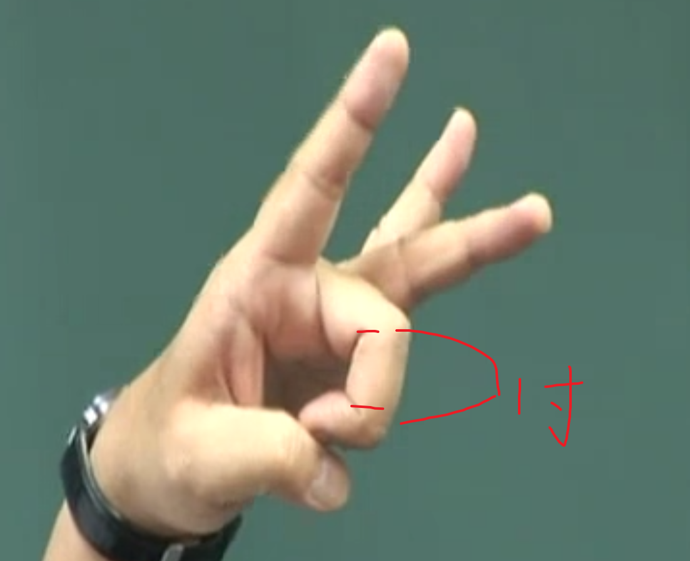
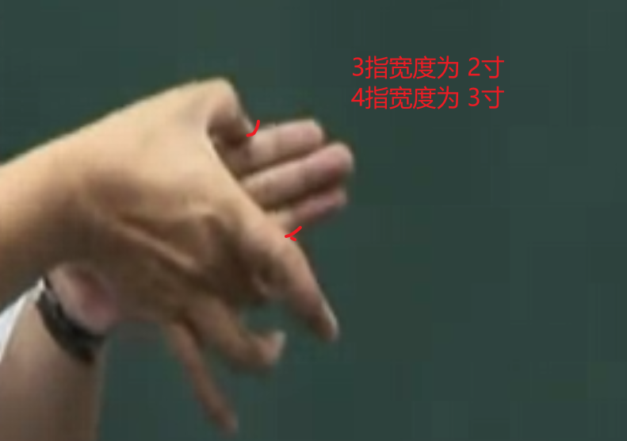
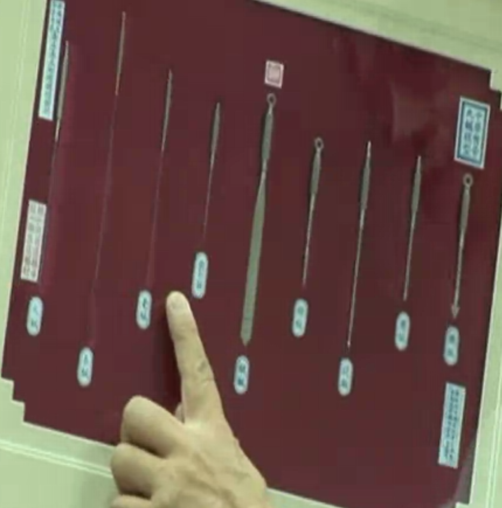

# 针灸 第二篇

## 一、针灸穴位的丈量法则

### 1.同 身 寸 （主要使用）

​	手指弯曲，食指中间有两缝，之间距离为 1 寸

​	3指并拢，中间距离为 2寸

### 2.胸部 腹部，用均等法

## 二、针刺的深浅讨论

### 1.天气

春夏天气热，浅针，秋冬天气冷，深针

### 2.病的位置

皮毛（肺） -> 肌肉（脾）-> 血脉（心）- 骨（肾）

背薄似饼，腹深似井

### 3.病人的胖瘦

### 4.穴道的本身的位置深浅

## 三、一般针刺入穴方法

记住 穴位不在 血管上面。 注意 之间 二字，就是两者的缝隙处

### 1.肌肉之间

### 2.肌骨之间

### 3.肌与筋之间

### 4.筋与筋之间

## 四、成人与幼儿的不同

### 成人 留针

​	10-20 min

### 幼儿 单刺

​	14岁以下不留针

### 取针的方式

 抽取往上，方向保持一致

刚开始慢慢抽，到了皮肤附近停3、4秒，然后一下子抽出来

### 晕针

 1.扎针穴道 姿势方式正常的话，晕针是好现象。说明治疗有效果。

 2.扎针，姿势不对的话，也可能会晕针，没效果。也不会产生副作用。

## 现代常用的针号概念

32号- 细（1寸半，肌肉）

28号- 中等 

1-5号- 粗

针灸做的好，立竿见影。

## 黄帝时代的九针型式

豪针用的最多

