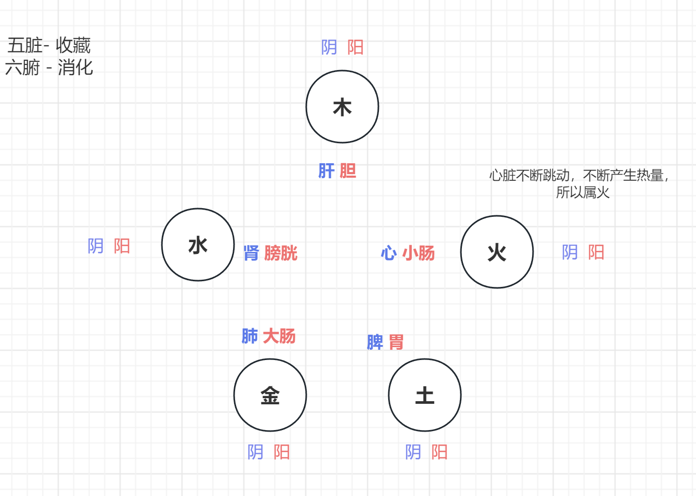
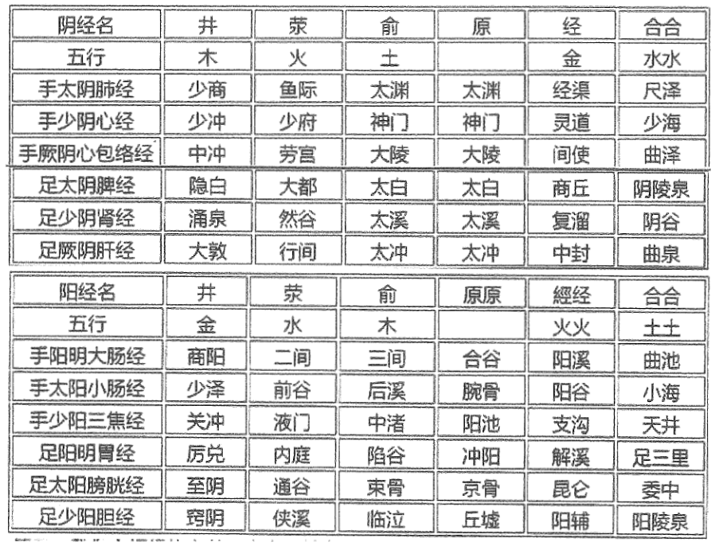

# 针灸 第三篇

## 十二经 纳 10天干歌

甲胆乙肝丙小肠，丁心戊胃己脾乡。
庚属大肠辛属肺，壬属膀胱癸肾藏。
三焦亦向壬中寄，心包同归入癸水。

## 十二经 纳 12地支歌

肺寅大卯胃辰宫，脾巳心午小未中。
申胱酉肾心包戌，亥焦子胆丑肝通。

肺 - 3 - 5  am

大肠 - 5-7 am

胃  -  7-9 am

脾 - 9 - 11 am

心 -  11-1 pm

小肠 1-3 pm

膀胱 3-5 pm

肾 5-7 pm

心包 7-9 pm

三焦 - 9-11 pm

胆 11-1 am

肝  1 - 3 am

## 十二正经之 井荣俞(yu) 原经合穴

### 十二正经脉

#### 六阳经 

​	

#### 六阴经

​	

### 奇经八脉

任脉/督脉、冲脉/带脉、 阳跷脉/阴跷脉、 阳维脉/阴维脉

### 穴

每条经脉都有： 络穴、原穴（只在阳经）、井穴、荣穴、俞穴、经穴、合穴

井荣俞原经合穴里 讲的： 都是 是 手不过肘，足不过膝

井穴 ->  病在藏，井穴来的好。

荣穴 ->  病症有颜色出现的时候， 取荣穴。

俞穴 -> 按照时间发病， 取俞穴（也可取荣穴）

经穴 -> 病症有声音变化， 取经穴

合穴-> 病症 有 饮食不节症状, 嘴巴感觉有味道， 取合穴

原穴-> 五脏不平衡，不安的时候，取原穴

## 井 病在藏者取之

## 荣 病变于色者取之

