# 针灸 第四篇

## 十二经络 奇经八脉简介

春  夏   长夏    秋    冬

- 长夏:（季节交换的时候那个月， 春夏交接那个月后两周，夏季初2周 合并成一个月，4个季节转换一共4个月）

春夏养阳，秋冬养阴

## 任脉 与 督脉

任脉：头顶前面，百会往下走，怀孕就是靠任脉，有形的东西靠，诸阴之海，所有阴经都会汇集到 任脉

督脉：头顶后背，会阴往上升，是动力，能量的源泉

任脉连接督脉：舌头顶到上牙齿末端，就是任督连接起来了，有益身体健康。

十三鬼的穴道：人中(鬼宫)、少商(鬼信)、隐白(鬼垒)、大陵(鬼心)、申脉(鬼路)、风府(鬼枕)、颊车(鬼床)、承浆(鬼市)、劳宫(鬼窟)、

​						   上星(鬼堂)、男会阴女玉门头(鬼藏)、曲池(鬼腿)、海泉(鬼封)

​							（鬼门十三针 慎用，对施针者会有反噬效果，折寿）

回阳九针：

后升前降：

​		心脏的热量直接传到小肠，小肠蒸发 肺传下来的 肾水，通过督脉上升到脑髓，脖子处冷却。

​		然后再从脑髓通过任脉，下来。完成一个循环。

平补平泻：扎针后 左右旋转，粉红色，酸、麻、涨，气血到了。

补泻手法（提、入）：病人酸胀感有了以后，气到了，取针时，捏入豆许，泻气；提起来，补气

痛：是由于压力。中医是 温度、压力、速度、时间的 物理医学。

心痛澈背、背痛澈心： 痰饮造成的，针（天突、巨阙、关元 ），去掉痰饮就好了。

牙痛：蔗糖大分子是碱性，细菌病毒无法吸收，现在的精炼糖是酸性，吃到嘴巴里，细菌病毒会吸收

八纲：

​	阴阳、表里、虚实、寒热

寒热简单区分： 小便颜色，白色寒，黄色热；剧痛热，隐隐作痛寒；

**八会穴**：（髓会绝骨、骨会大抒、筋会阳陵(泉)、血会隔俞、气会膻中、脉会太渊、脏会章门、腑会中腕）

郗xi穴：每条经脉都有 郗穴,治疗炎症居多，止痛

每个经络都有子穴，母穴，阴经就是木火土金水，阳经就是金水木火土。

原则：

- 对称取穴治疗，例如：会阴痛，针百会
- 近取穴（症状附近的穴位）
- 俞墓治疗法
- 会郗治疗法

### 任脉

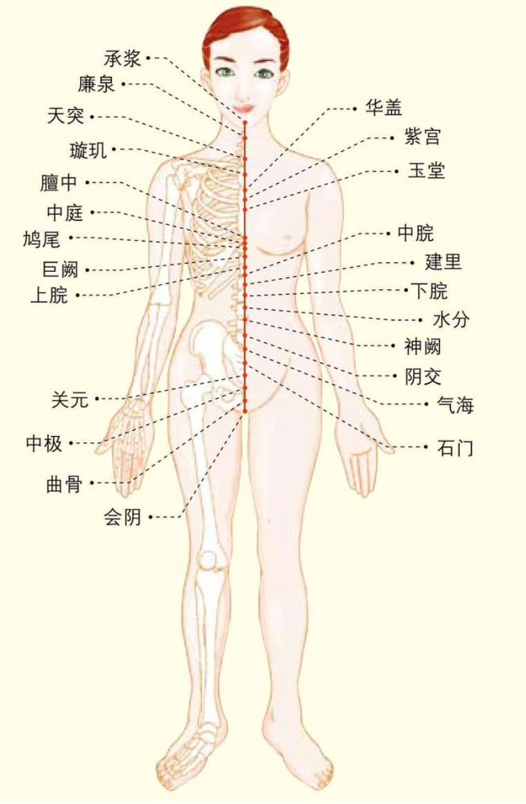

会阴：睾丸肛门中间， 阴道肛门中间  （3寸长针，对着心脏的方向下针，急救，很少下针）

​			对称的穴是百会

曲骨：耻骨（白带病），此处体毛比较多，针比灸好。

中极：耻骨上1寸（膀胱之墓穴），曲骨与神阙中间分5等份距离，为5寸

​				膀胱的问题可以针灸这里，腹部肉多，可以深一点

**关元**：耻骨上2寸（小肠之墓穴，第二心脏），每天灸关元（精力旺盛）

​			心脏问题，也可以灸关元，女生寒症无法怀孕：也可以灸关元

​			怀孕不能灸关元、扎针，怕伤到胎儿。

​			肌肤甲错，内有淤血。

石门：耻骨上3寸（三焦之墓穴）

​			关元和石门中间 有个 （绝育）穴（不能灸、扎针）

气海：肚脐下1寸半（经常灸也很好，有益健康）

阴交：耻骨上4寸（三焦之墓穴）

**神阙**：肚脐（耻骨上5寸）禁针 （扎针后，大便会死）（隔盐灸）

**水分**：中脘和神阙分成4等分，上1/4处

​			该穴与津液有关。水分从小肠蒸发吸收回到肺，肝，全身津液，如果阳气不足，水分就无法吸收，大便稀。

​			上消：渴饮百杯，不止渴

​			中消：饥食百碗，不解饥

​			下消：阳不举

下腕：中脘和神阙分成4等分，上2/4处

建里：中脘和神阙分成4等分，上2/4处

**中腕**：（胃之墓穴，**腑会**中脘）胸胁中间骨下端（鸠尾） 到 肚脐（神阙）中间位置

​				治疗肠胃病，非常好用

​				梅花灸：中脘、中脘上一寸、下一寸、左一寸、右一寸（注意出血时不能灸）

上腕：

**巨阙**：鸠尾和中脘的中间位置

​			心脏病，针 关元、巨阙

鸠尾：巨阙上一寸

​			禁灸可针，该穴到用力冲击，会内出血。

​			膏之源，与三焦有关。

中庭：膻中下面是中庭（膻中穴的辅助穴）

**膻中**：（**气会**膻中) 玉堂下一寸半

​				强心脏、强肺气、可以促进母乳

  

玉堂：鸠尾和天突中间位置（膻中穴的辅助穴） 

紫宫：华盖玉堂中间

华盖：天突玉堂中间位置

璇玑：华盖天突中间

**天突**： 位于颈部，当前正中线上胸骨上窝中央，下针斜向下

**廉泉**：大拇指摸下巴底部，指尖处位置。下针方向朝向舌尖

​			舌头僵硬，无法正常讲话。

**承浆**：下巴和下嘴唇 中间凹陷位置。下针需要嘴巴张开

​			 面部中风（扎人中+承浆）、

### 督脉

诸阳之海，所有阳气、阳经都会回流到督脉。

带脉：肚脐之下

维脉：第七椎之上

眼诊：

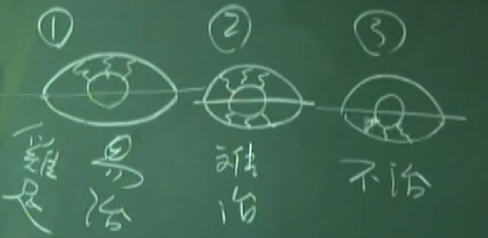

定位背脊骨： 肩胛骨下边缘 2点连接中间位置，就是第七椎

​			

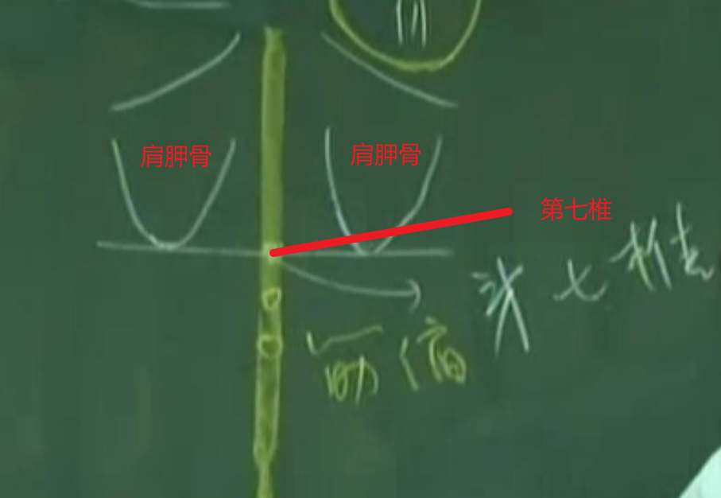

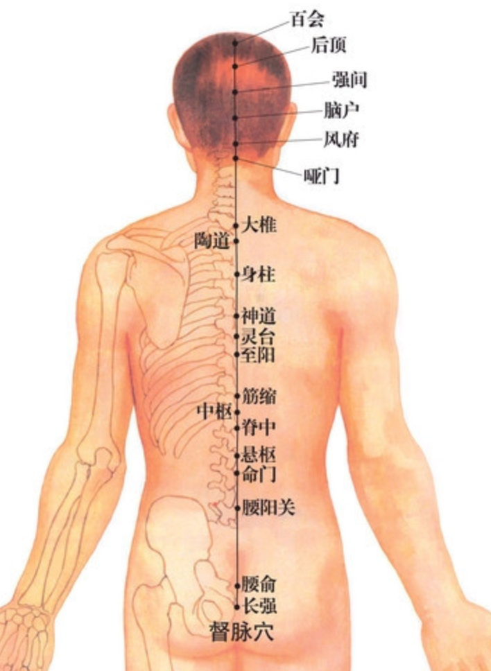

长强：尾椎骨和肛门的中间，针水平斜向下30度左右

​			治痔疮

腰俞：

阳关：命门下2椎。脊骨16节下

命门： 肚脐的正后方。脊骨14节下

​			剧烈的头痛

悬枢：（三焦经过的地方）脊骨13节下

​				腰痛

脊中：脊骨11节下（脾的正中）

​			黄疸、便血

中枢：

筋缩：（肝主筋）脊骨9节下，在肝脏旁，与肝有关的穴

​			抽筋、癫狂、癫痫

​			消渴：糖尿病人诊断用，针灸不痛病就好了

至阳：血会的地方，脊骨7节下，诊断用

灵台：脊骨6节下，诊断用，

​			有压痛感，过实症（血癌）治疗有效果的话，3个礼拜就不痛了。

神道：脊骨5节下

​			有压痛感，心脏病，治疗好了就不痛了

身柱：脊骨3节下， （第三椎骨坏了，全身瘫痪无法治疗）

​			小孩子经常灸身柱，会长高。

​			不喜欢看到人，阴症，灸身柱，提高阳气，非常好。

陶道：第一椎下，第一椎不会动，

​			

**大椎**：第一椎上

​			高烧下针放血就好，

**哑门**：风府下半寸（只针不灸，下针，对着舌根；灸哑门会哑掉禁止灸）

​			专门治声音发不出来。

风府：脑骨下（只针不灸）

​			治疗，中风，头脖子僵硬，

脑户：脑骨上面有个突出得骨头，下面就是脑户

强间：脑骨上面有个突出得骨头，上面就是强间

后顶：百会下一寸半，辅助百会穴。

**百会**：头顶正中，耳朵左右连接，鼻子垂直线，交汇处就是百会，有个很小凹洞

​			下针：斜切30角度入，扎入头皮，穴在头皮，不是在头骨里面，不可以垂直扎针

​			中风、急救、头痛。 针百会（百病皆止）

​			tips：头顶旋，顺式针，下一胎同性，逆时针异性。

前顶：百会穴往前一寸半前顶穴

聪慧：前顶往前一寸半

**上星**：聪慧往前一寸半

​			灸上星，米粒灸，治疗鼻窦炎。7、9、11壮。就可以了

​		

神庭：上星往前五分，可以从鼻子中线处向头顶方向推上去的第一个凹陷处，就是前庭穴。

素髎liáo：鼻头，（不能扎针，一般是放血）该穴与会阴穴有关

​				 判断是否处女：鼻头是两瓣，分开的是非处女

​				 酒槽鼻，可以扎针放血。

水沟：在面部、当人中沟的上1/3与中1/3交点处

​			早上起来脸肿肿的，可以扎针水沟

对端：上嘴唇中间上方，凹陷位置。

​			

龈交：上嘴唇拉上去，门牙中间 只针不灸

​			牙龈痛，扎针放血， 新的血进来补充营养。

## 手太阴肺经

阴经：（井/木，荣/火，俞/土， 经/金，合/水）

五脏逼毒法：排肺毒 ，脚踮起来，手托天，同时嘴巴发嘶嘶突起，吐完后，再发力吐最后一口气结束。

肺：传导之官，治节出焉，气之本 ，主皮毛，开窍在鼻，音在商（四），味在辛，情志在忧（负责忧的情绪），喜能胜忧，五行属金（魄）

肺法象天幕：像皮肤包裹全身，手脚心是热的，其它皮肤是冷的，就是正常的。

诊断肺的健康：秋天，摸脉，轻触浮脉，心情不忧虑。晚上3-5点睡的好

补泻手法：实则泻，虚则补。 顺为补，逆为泻（顺经脉流向下针）实拒按，虚喜按。

虚实判断：新病为实症，泻其子，旧病为虚症，补其母

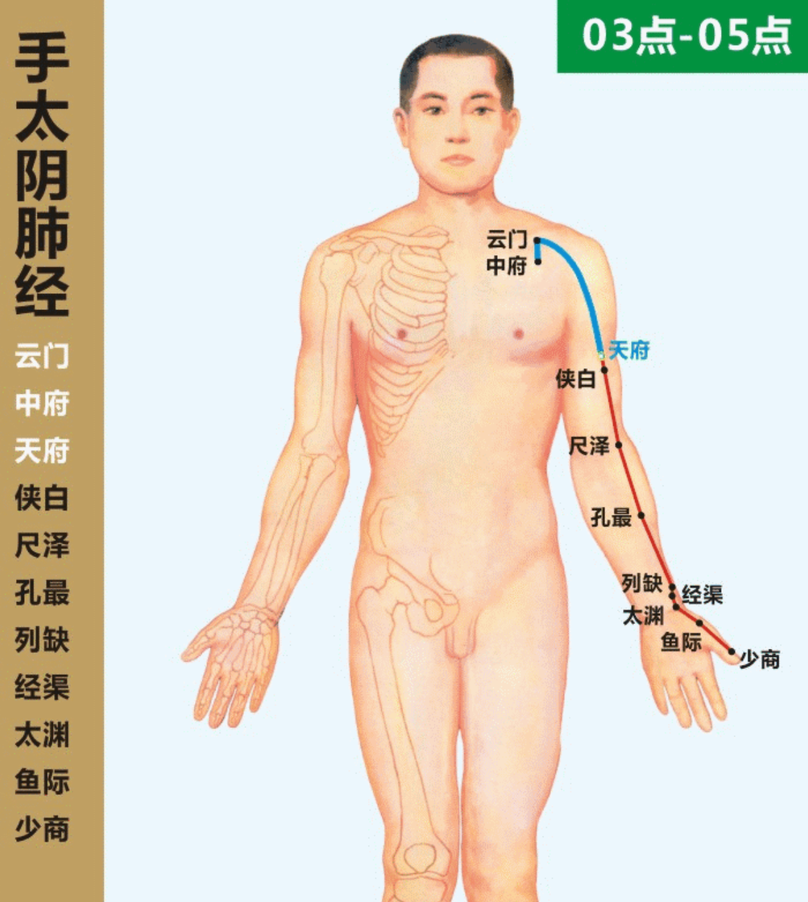

### 穴道

中府：云门下1寸，平第1肋间隙，（下针从中府斜向上扎，达到云门穴，一针扎两穴）

云门：锁骨下窝凹陷中，肩胛骨喙突内缘。（肺之墓穴）

​			治疗：甲状腺、淋巴、腋下肿瘤

天府穴：腋前纹和手臂中关节 两点中间处肌肉缝隙。

​				无论什么病，外伤内伤，只要是流鼻血，左边鼻孔流血，扎右边，可以止血。对称治疗。

侠白：天府下一寸

**尺泽**：（合穴-属水，子穴）手肘上有大筋，大筋的外侧，手弯曲的就是尺泽穴（只针不灸，容易出汗不可灸）

**孔最**：（郗xi穴）尺泽下三寸，

**列缺**：（络穴）尺脉，经渠下半寸；左右手掌虎口相扣，食指伸直末端。

​				主任脉，任脉上的病可针该穴。

**经渠**：（经穴，属金，手太阴肺经的本穴，可泻可补）关脉 手腕 凸起骨下。

​				反关脉的人，非富即贵。

**太渊**：（俞穴，属土-手太阴肺经母穴）寸脉，经渠上半寸，气会膻中，**脉会**太渊。

​				治疗：肺虚、旧咳为虚；脉跳跳停停，心律不齐

**鱼际**：	(荣穴,属火) 拇指本节（第一掌指关节）中点凹陷处。

​			  	肺病症有时症，也可以取荣穴。

**少商**：(井穴,属木)  以右手为例，大拇指指甲左下角。

​			一般是点刺放血用，小孩子扁桃体发炎肿大‘；发烧可以大椎、少商一起放血。

## 手阳明大肠经

手阳明大肠经属金。

阳经：（井/金，荣/水 ，俞/木， 经火金，合/土）

哮喘：吸气归肾管，吐气归肺管。

手臂酸痛：无法抬起-大肠经，手不能往后-小肠经，手不能梳头-三焦经。

原络治疗法：取原穴、络穴治疗。（原/病经，络/表或里经）

​						大肠的问题（虚实都有），先取大肠经（表）原穴，然后再取肺经（里）的络穴。

虚实之分：实症痛（一周内），实中带虚（一周以上，痛多酸少），虚中带实（酸多痛少），虚症（酸）

虚实治疗：实症（泻），实中带虚（先泻后补），虚中带实（先补后泻），虚症（补）

儿科诊断：小孩左食指，从下到上三节，风关（青筋病在浅）、气关（青筋病在重）、命关（青筋病不治），

开四关：合谷（左右2个）、太冲（左右），病人全身到处都痛，然后扎4关，最后痛的位置就是真病痛。

捻转手法：顺为补，逆为泻，快速旋转，慢慢收回，补取阳数5下，泻取阴数6下， 

迎随手法：倾斜顺着经脉方向下针。

中风：手掌筋挛，扳不开，直接用三寸针，从合谷透到后溪。

​			舌强不语：针脑后的风府。

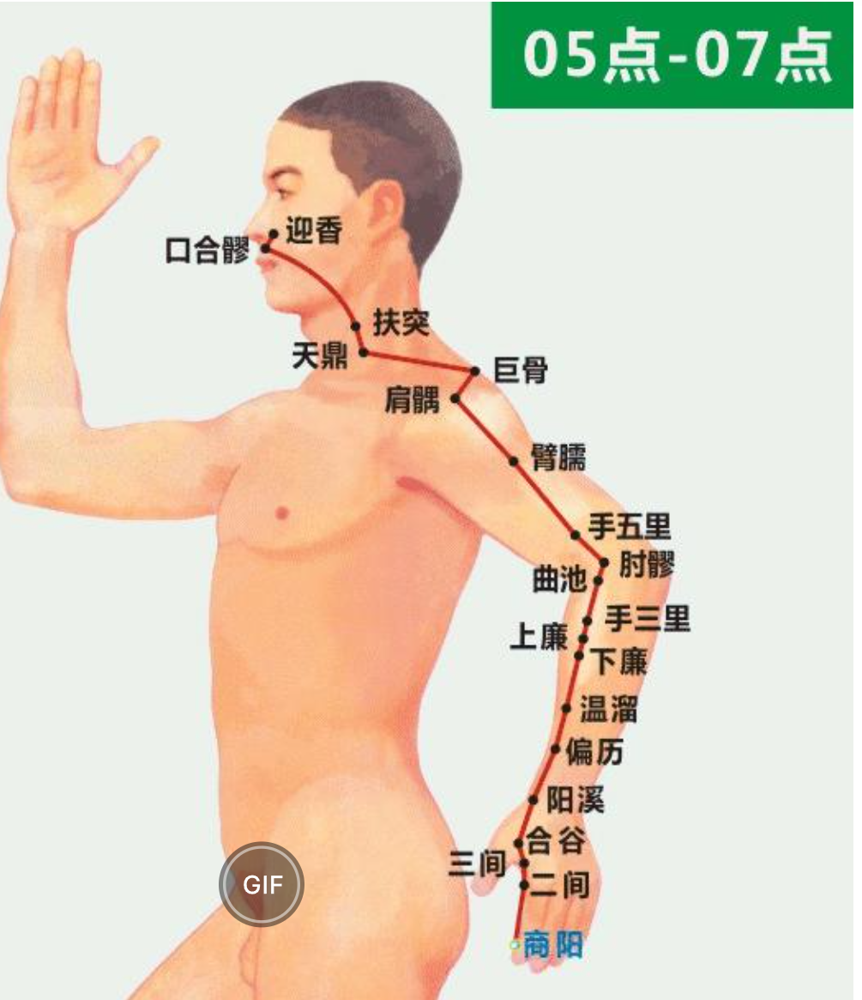

### 穴道

**商阳**：（井穴/金），左手食指，右下角。

​			发烧，少商、商阳，点刺放血，几乎所有的烧都可以去掉。

二间：（荣穴/水，子穴），食指弯曲类似Ok手势，食指根部横纹上方一点

三间：（俞穴/木）食指关节后，往后摸，靠近虎口，有个凹陷位置。

**合谷**：（原穴）拇、食指合拢，在肌肉的最高处即是。气穴。

​				面口合谷收，面部透针的时候，因为比较痛，下合谷，有麻醉作用，记得下对侧。

​				灸合谷，美白，美容，去脸上长痘，去油。

​				牙痛：上牙，左边牙痛针右合谷，中间痛两边合谷都针

​				该穴孕妇可泻不可补。判断孕妇震痛是否真的要生了：合谷有气脉动直到食指商阳。

阳溪：（经穴/火），跷起拇指，拇指根与背腕之间有一凹陷，凹陷处即为此穴

偏历：（络穴）与肺经络穴是通的，也是反关脉的地方。

​			治疗肩痛，大肠实症，牙痛、耳鸣。虚则齿寒，补之。

温溜：（郗xi穴）偏历穴上两寸

​				大肠经的炎症，可以用他。

下廉：上廉下一寸，

上廉：手三里下一寸，

手三里：曲池下两寸

​				扭伤了：腰闪了，落枕了，下针左右旋转。

​				

**曲池**：（合穴/土，母穴）手臂拱手姿势，横纹与肘骨中间处。

​			  捻转手法，上半身止痒，合谷、曲池效果最好。

​			   肩膀痛。

肘髎liao：拱手的时候，曲池往后有个大骨，过这个骨头就是肘髎。

​				  打网球受伤，可以下针放血，用火罐吸点血。

手五里：肘髎往上三寸，禁针，因为有大动脉在，很少用

臂臑nào：肩髃穴下2寸，就是两个肌肉的中间。

​					与手阳明络手足太阳阳维之会，几个经络会到的地方，

​					主治瘰疬（luǒ lì）又名老鼠疮，臂痛

**肩髃**yu: 手臂上有个凹洞，这个凹洞就是。手阳明、阳跷脉之会

​			  治疗中风的大穴。半身不遂，不能张弓射箭。

​				治疗肩膀的问题，就在这下针。

巨骨：从肩髃穴上来，两边骨头有个缝，就是巨骨

天鼎：脖子上一个大筋外侧根肋骨交接的地方

扶突：喉结这边

禾髎：鼻孔的下方，左右2个

​			治疗鼻窦炎，

迎香：鼻旁开分。

​			治疗，鼻窦炎，很严重的鼻塞，鼻子不闻香臭，一针下去，就可以闻到，见效极快。

​			透迎香：针扎进去以后，透过皮层然后倒下来，把肉拉起来，一路往透到山根（鼻根），不要扎太深，扎到眼骨。

​			这个穴位叫内迎香，透之前先针合谷，麻醉。

## 足阳明胃经

阳经：井/金、荣/水、俞/木、经/火、合/土

**辰时**：早上7-9点

土克水的意思是，水是肾脏，肾脏有问题会把土淹没掉，水也会反土，

所以说胃是肾之关，肾关门的地方，严重的肾脏问题，会恶心，不断的吐。

**乳癌**：中医古代叫岩症。奶水=月经，同一种东西的两种状态。月经不是排卵，妇女哺乳的时候，几乎没有月经。哺乳期间没有月经也会怀孕。心主月经、奶水。

​			看硬块在哪个经脉上，属于哪个经脉的问题，再辩虚实，然后扎对应的穴道。

**腹四针**：中脘、关元、天枢（左右2个），治疗胃口不好，又有便秘，肚子又痛，小便又白。

​				小便淡白，灸天枢，其它下针。小便深黄色，下四针，腑病最好治，没有什么虚实补泻。

​				针下去，左转右转，病人感到酸麻胀就好了。

**助孕**：灸 关元、中极、气冲、归来。

**解穴功能**： 梁丘下面一点有个 经外奇穴，解穴。还有一个是在手上的少府穴

​					比如，下针太渊，经渠时，不小心扎到动脉，肿起来，下对面的解穴。

​					解穴就是当你下针后的针感、很痛、很难过，包括下针肿起来，针一下解穴，病人会感觉有个东西在跑，

​				   马上就消肿，压力去掉了，就没这么痛了，过去武功高强的点穴，点穴后解不掉，解穴一点就好了。

**五穴四针（治疗关节炎）：**第一个穴在膝盖的头，不要扎到膝盖骨，再加2个膝眼，再加阳陵泉、阴陵泉

​												从胆经的阳陵泉透到脾经的阴陵泉用三寸针。

**足三里补泻手法：**病人血压上升的时候，脸充血，阳亢。在足三里斜刺入5分。

​								顺为补，逆为泻，补是单数，泻是偶数，顺着经络方向快速捻针，慢慢收回

​								吃黑色的食物，海带等补肾，多灸足三里，补胃，长寿。

**补井当补合，泻井当泻荣**：遇到要在井穴做补泻的时候，如果遇到井穴是子穴，没有办法在井穴上补泻就改用荣穴。

​												如果井穴刚好是母穴时，我们就补用合穴。

**善针者，善导引也**：山，陵，沟，谷，这个穴道的名字，都有导引的含义。

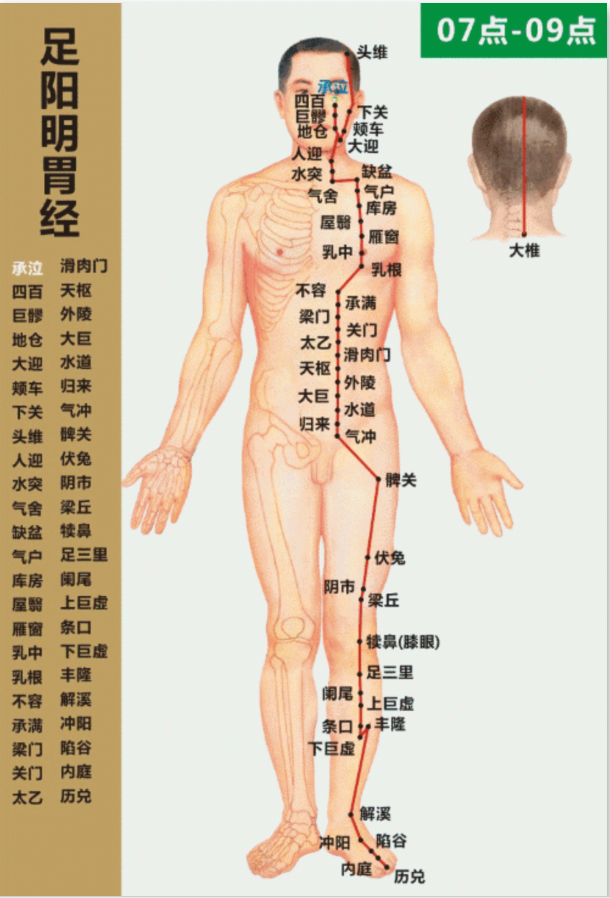

### 穴道

头维：发际这边，正好在转角的地方，有个凹洞。禁针灸（很少用到这个穴道）

**下关**：鬓角下面一点，嘴巴闭上就有个凹洞，嘴巴张开就隆起。（只针不灸）

​			治疗牙科，下巴脱臼，耳流脓，牙关痛，不能咬。

​			下针时，先下对侧合谷，再针下关

**颊车**：下巴这边有个肉，咬牙时，肌肉会起来。肌肉跳动的地方就是。

​			治疗面部中风，口张不开，口噤不语、失音，口眼歪斜。

​			下针方式：地仓透颊车，需要先下对称合谷。

承泣：眼睛下面骨头，上面一点凹陷处。

​			是足阳明、阳跷、任脉会穴。

​			诊断用：

四白：眼睛下面一寸。

​			治疗眼疾，内翳

巨髎：眼珠四白一条直线下路，跟水沟平齐的位置。也是颧骨下方，下方有动脉，不可下针太深

​		    是手阳明、足阳明、阳跷脉会穴

​			治疗牙痛：拔完牙很痛，此穴下针，效果很好，局部肌肉麻痹

地仓：嘴角旁边，地仓不饱满说明胃气不够。

​			

大迎：在下颔这个地方，地仓颊车中间。

人迎：大迎下面就是人迎

**水突**：喉咙处的大筋，上面是人迎，中间就是水突，下面是气舍

​			治疗瘰疬，甲状腺肿大，下针时把大筋捉主，不要碰到血管，扎5分进去

气舍：大筋下面就是

缺盆：锁骨正中央（不针，容易扎到肺）

气户：缺盆隔一个骨头

库房：再隔一个骨头

屋翳：再隔一个骨头

膺窗：再隔一个骨头，乳房的上根部。

​			针灸这里可以丰胸，

乳中：禁针禁灸

​			乳头络到肝经。这也是乳癌切除后，会转移到肝癌。

乳根：乳房下面根部。女性需要将乳房托起来。才能看到。

​		    针灸这里可以丰胸，还有个丰隆穴。

不容：巨阙/心脏的墓穴  旁开2寸。

​			心口痛，吃东西，喝水腹部涨会吐，食物不容纳，这也是这个穴道名字原因。

​			

承满：上腕旁开2寸

关门：

太乙：

​			  增高。下针，灸都可以。胃口大开

滑肉门：

​				增高。下针，灸都可以。胃口大开

**天枢**： （大肠的墓穴），神阙旁开2寸

​				 指按这个位置，病人大叫，就可以判断 便秘的垃圾 在大肠。也叫燥矢，宿便。

​				当燥矢太强时，横膈膜挡不住浊气，人会发狂奔走。

​				如果时寒症，在天枢上面灸比针好。如果时热实，下针会比灸好。

外陵：阴交穴旁开2寸

​			怀孕的孕妇，在腹针时，肚脐以下最好不要针。

大巨：石门穴旁开2寸

**水道**：关元穴旁开2寸

​			治疗肠鸣、腹泻，如果腹水，水肿，配合水分穴一起用。

归来：中极穴旁开2寸

​			睾丸不见了，缩到腹部，下针归来

气冲：曲骨穴旁开2寸

​			

髀关：伏兔上面六寸

伏兔：膝盖头往上六寸，这个穴道跪着时，肌肉隆起像兔子一样

​		    可以治疗脚膝冷。

阴市：梁丘上一寸

​			治疗晚上膝盖冷，又痛。

​			

**梁丘**：（郗xi穴）膝盖头上2寸，外开一寸

​				治疗消炎、红肿的， 膝盖、脸上痘痘、伤痕，消炎快速好。

​			   梁丘下面一点有个 经外奇穴，解穴。

犊鼻：膝盖的盖子跟胫骨中间有个韧带，中间就是犊鼻

​			 膝盖两边有个凹洞，就是经外奇穴，**膝眼** 下针时直进直出，因为里面有油囊，不能捻针

**足三里：**（合穴，土，本穴）膝盖头下去三寸，从手指顺着胫骨从下往上，开始高起来的地方，起点外开一个指头

​					按住足三里，冲阳脉就没了，说明你足三里找对了。

​					治疗所有胃病（但吐血除外）。男人年多三十，多灸足三里

​					有人脚不能走远路，没有脚力，扎足三里。此穴道灸针都可以，灸百壮都可以，把燥热的气导下来。暖胃

​					奇穴：足三里下一寸， 阑尾穴。辅助诊断，如果此处有压痛，说明肚子痛具体位置是盲肠炎。

​								为了确保肠里的大便出来，再下针大肠墓穴天枢、小肠墓穴关元

上巨虚：足三里下3寸，

​				治疗足阳明胃经 上的乳房硬块，乳癌，实证。

**条口**：	上巨虚下一寸

​				治疗脚麻，糖尿病也会脚麻。补水，去老糖。

下巨虚：上巨虚下3寸

​				治疗肚脐以下，足阳明胃经 上的有硬块，肿瘤，实证

**丰隆**：膝盖下外侧凸起骨头，到脚踝凸起骨头，两点连线中间位置

​			丰胸，导痰，去痰的穴道，喉咙痰很多，手法：下针后左转右转，涨满感，气引到后把针提气来到皮层，然后倒下来45度对着身体			方向下针，然后再左转右转捻针，引气到，然后再提针到皮层，然后倒过来45度，对着脚下面方向下针，捻针，引气，这就是导			痰。

解溪：（经穴,火-母穴）腿跟脚关节处，两条大筋中间凹陷位置。

​				治疗胃经上虚证

冲阳：（原穴）解溪下2寸，这里有动脉，不能扎在动脉上。扎旁边。

​				原穴补泄都可以做，实症、虚症都能治，用32号1寸针

​				冲阳脉还在，代表胃气还在。

陷谷：（俞穴，木）内庭上2寸

​				按照时间发病都可以扎俞穴，例如每天早上7-9点头痛，扎胃经俞穴。

内庭：（荣穴，水）足第二趾与第三趾交缝上5分的地方，可以摸到两个脚趾骨，骨头后下针

​			 治疗胃经实症， 远取穴， 下牙痛，下针胃经内庭，上牙痛，下针大肠经-

厉兑：（井穴，金）内庭往下走到脚趾甲旁边

​			  治疗胃经实症 ， 胸口痛

## 足太阴脾经

井/木、荣/火、俞/土、经/金、合/水：

中医脾包括 脾脏、胰脏。脾主四肢肌肉，谏议之官。统血，吸收食物营养，然后分配给各个器官。

脾主四肢、主肌肉，脾主少腹，脾统血，脾主身上的湿热。

脾五行属土。黄色食物入脾脏，宫音入脾，思虑过多伤脾。主嘴唇。呼吸的呼就是宫得音

脾脏排毒法： 双手摸住脾脏位置，嘴唇嘟起来，呼气，直到气完了，然后提肛，用力呼出最后一口气。

胃属表，脾属里，互为表里。胃主气，脾主血，味厚入血，味薄入气，咖啡味厚酸，入木，木克土，喝咖啡会引起胰脏癌。

**中风预兆**：手前三指，会麻。

脾虚嘴唇会比较白。

**实的分类**：一种是淤血，一种是积快（瘤），腹诊可以查到，如果有淤血，从左侧关元穴外开3、4寸，骨头旁，会有压痛点。

​					人体左侧主血，右侧主气。所以如果子宫、腹腔有淤血，一般我们在腹部的左边会有压痛点。

**孕妇的种类**：血旺气衰（好），气旺血衰（不好），血衰容易落胎。

​						气表现在**合谷穴**，血表现在**三阴交**， 不懂孕妇气旺血衰的概念，这三阴交、合谷不能下针。

**腹寒**：灸三阴交。而且也有利于怀孕。灸关元也可以治腹寒，助怀孕。

**三皇穴**：（阴陵泉，地机、三阴交）都属脾经-土，土能克水，治疗腿没有力，也可以专门治疗水肿。这三个穴道会出水。

**下针深浅判断**：病在皮表，病在脏，病在腑，病的深浅决定，还有就是人本身的胖瘦决定。

**痛经三穴**：（三阴交、血海、中极）世界上所有的痛经都可以治。

**病痛发作时下针**，效果最好。

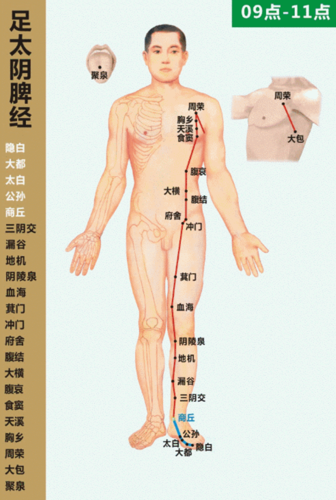

### 穴道

隐白：(井穴，木) 左脚大拇指甲，右下角。

​			肚脐以下就是腹，脾也主腹部。隐白穴治疗女性白带，

​			奇穴：三毛穴，大拇指甲下面一点长了三根毛，所以叫三毛穴，灸三毛专门治疗失眠。

大都：（荣穴，火，母穴） 脚大拇指与脚掌关节处，有一条缝，侧面平行于脚掌下针，不是垂直脚掌下针。

​				治疗脾虚，虚则补其母穴。

太白：(俞穴，土，本穴），大都向下绕过脚掌大骨后面有个凹陷，就是太白

**公孙**：（络穴）脚掌上方有个凸起来的骨头，在这个骨头下方跟肌肉交接的地方，就是公孙，整个冲脉都是公孙在管

​			治疗胃心胸病。胃吐血下公孙，妇女怀孕恶心呕吐不止，下公孙。

​			

**商丘**：（经穴，金，子穴）脚掌往前伸直，胫骨前肌腱内侧与脚踝形成凹陷处。

​			商丘穴，有帮助怀孕的效果。

​			左脚公孙穴附近痛，左病右治，下右脚商丘穴。还痛可以扎右脚公孙。

​			左脚公孙穴附近痛，对称治疗，下右手鱼际穴。

**三阴交**：（人皇穴）内脚踝，沿着胫骨往上3寸，骨头的后面就是三阴交。三条阴经交汇处（肾经、脾经、肝经）

​			治疗妇科病效果好。也可以治疗水肿，脚积水，

​			妇人月经痛，扎三阴交，痛马上会去掉。没去掉就是你穴位没有扎对。

​			诊断月事好不好，按按三阴交就知道了。

漏谷：（络穴）禁灸，三阴交上三寸或从脚内踝上六寸。

**地机**：（郗xi穴，地皇穴），阴陵泉下三寸。

​				消炎、镇痛。水肿腹坚、肚子涨满，女生腹部有肿瘤，硬块。

**阴陵泉**：（合穴，水，天皇穴）取曲膝之[横纹](http://www.a-hospital.com/w/横纹)尖头处，摸骨法就是胫骨拐弯凹陷处，也是小腿肌肉上边缘处。

​				 治疗膝盖风湿、水肿，像小便失禁、小便频数。

**血海**：手掌盖住膝盖骨，大拇指尖处。不深针，一寸就勾了。

​			治疗女人痛经，滴漏不止，月经不来。在痛时下针效果最好， 是立竿见影的。

​			奇穴：百草窝，血海下一寸。这是我们诊断身体里是否有蛔虫，寄生虫。‘

​						按到就痛，说明体内有虫，需要此处下一针

箕门：血海上5寸处。

冲门：曲骨穴外开4寸。

​				冲门痛不方便下针，可以对称治疗法下云门，或者下脾经的子穴，或者母穴。

​				生完小孩后，很多人胎盘下不来，冲门穴也是很好的穴道。门打开，让胎盘下来。

府舍：从中极找府舍，曲骨上一寸中极，中极外开4寸就是府舍

腹结：石门外开4寸，也就是肚脐下2寸，再外开4寸。

大横：神阙外开4寸。

腹哀：从任脉开始找，建里外开4寸

​			治疗腹部、肠胃问题，大便不顺，胃不消化。

食窦：天溪下一寸6，也就天溪往下隔一根肋骨

天溪：乳中穴外开2寸。

​				治疗乳房硬块。

胸乡：周荣往下隔一个肋骨

周荣：中府跳往下隔一个肋骨即周荣

**大包**：胳肢窝底下6寸

​			总统全身大络，经脉主干道，次要是络脉。

​			大包时脾之大络，络是联络的意思，脏腑之间不能沟通时，要大包协调。阴经、阳经的络都是它在管

​			脾脏就好像水坝，水坝从供水到种田，都很重要，这个管道就是大包。所以脾脏能管五脏，是大包穴			的关系

## 手少阴心经

心五行属火。红色食物入心脏，徵音入心，开窍于耳，其味苦。发出呵的声音就是徵音，情绪在喜，过喜伤心，恐能胜喜。

五脏排毒法：后背撞墙，撞的同时大力把气吐出来 呵。

心君主之官，本身不受病， 心包膜会生病。现在很多心脏病是由于西药造成的。心脏本身不会得病。

心藏神，心中一滴血，永远有新的血进入心脏替换旧的血。这滴血藏神，这滴血没了，就藏不住神，就容易失眠，而且经常吃安眠药会伤害心脏。失神，神不在了，人容易忧郁自杀，而且还是微笑着去自杀。

**补井当补和，泻井当泻荣**：当井穴是母穴时，补就要选取合穴，当井穴是子穴时，泻就要选取荣穴。

### 穴道：

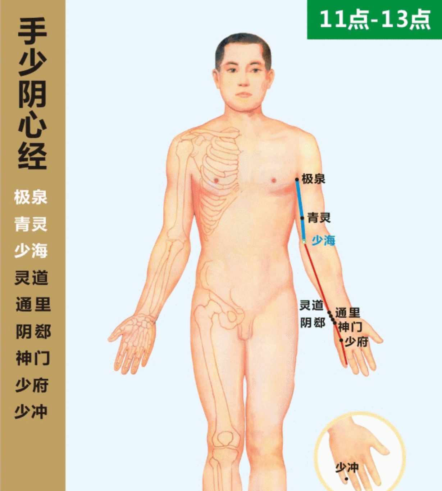

极泉：腋下胳肢窝。很少用到，帮助我们诊断。

青灵：内侧 手肘上三寸，很少用

**少海**：（母穴：合/水）手肘弯曲，内侧是少海，外侧是曲池。

灵道：（经/金）通里上半寸

通里：（络穴）阴郄上半寸

阴郄：（郄穴）神门上半寸

神门：（俞/土）手掌下面有个很粗的筋，在筋的内侧，手腕手掌横纹交接处

**少府**：（荣/火）握拳，无名指我小拇指到的位置。

​				心脏病急救大穴，

​				手解穴，

少冲：（井/木）在小拇指的内侧指甲旁。

## 手太阳小肠经

小肠-阳火，心脏产生的热量进入小肠，小肠消化了食物以后，变成水、残渣流入大肠，小肠热气蒸大肠水再流入肺，运动流汗，心在管。

小便的来源：肾->膀胱，三焦->膀胱。小肠靠近膀胱，热量气化水流到肝，所以说水生木。肺里面的阴水往下进入肾脏，然后再流入膀胱。这就是金生水。

膀胱有上口-三焦，也有下口-尿道

### 穴道

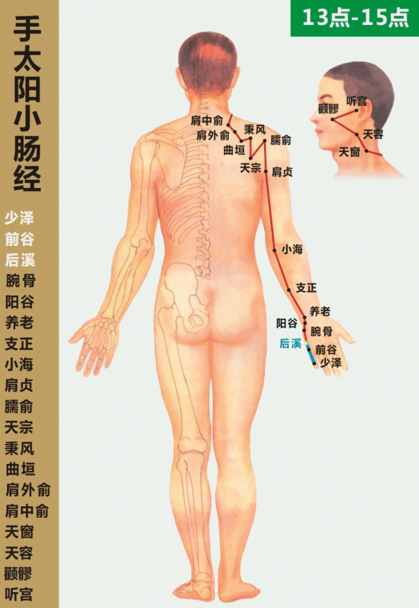

少泽（井/金）：左手小拇指的指甲左下角。

**前谷**（荣/水）：握拳，小拇指根节横纹末端。垂直下针，注意不要扎到骨头。

​						    妇女奶水不够。实证，下午1-3点精神不好。

**后溪**（俞/木，母穴）：握拳，前谷下面一条横纹末端。

​					后溪主督脉，列缺主任脉。任何一个奇经都有一个穴道在管。

腕骨：（原穴）古代练劈掌，小天星骨跟第五掌骨中间。

阳谷：（经/火，）手握拳，这个骨头跟掌骨中间有个大筋，在关节和筋的中间。浅针

养老：（郄穴）手腕关节下来一点，用右手指按住，手掌翻转，手掌朝脸，那个骨缝会打开，这个骨缝就是养老穴。

​			治疗 可视物不明，近视眼，白内障， 治疗 手不能拧毛巾，手肘扭伤，用 “养老穴 透 间使穴”。透完平补平泻后马上抽出来，不留			针，几秒钟，马上当场就好。

​			手上三个奇穴（肠关，肝关，心关），以左手为准。小拇指左侧从后面看，手腕骨，上三寸叫肠关，再上三寸叫肝关，再上三寸叫			心关，都在骨头的下面一点。不要扎到骨头。 肠关顾名思义，就关闭肠道，如果大便很急或肠子痛，就用手按住这个穴道或者扎			针。

​			

支正： （络穴）阳谷穴上五寸。

小海：（合/土，子穴）手肘三角形时，三角形顶点位置就是小海。一寸针，一扎就到了。

​				治疗小肠经的实症。

肩贞：臑腧

臑腧 ：大肠经 肩腧穴 背面。

天宗：肩胛骨中间。

秉风： 曲垣旁开2寸，先找到肩井穴，就是肩膀上边有个肌肉 挑扁担用到的，这个三角形肌肉顶端，在这个缺盆骨跟颈部正中间，可以			摸到。不可下针太深。会扎到肺。

曲垣：肩井穴下三寸。

肩外俞：陶道（第一椎下）外开四寸。 下针时，对着身体外侧方向下针。左右穴道下针 呈八子形

​				治疗肩膀酸痛，近取穴

肩中俞：大椎（第一椎上） 外开四寸。 下针时，对着身体外侧方向下针。左右穴道下针 呈八子形

天窗：人迎后三寸，脖子大筋后面。

天容：耳朵正下方。下颚脸骨跟部。

颧髎：太阳穴下三寸。

​			治疗牙痛。

听宫：耳屏前面有个骨缝，嘴巴张开才能摸到骨缝， 耳朵前面有个像山峰一样的东西加耳屏

​			这里还有两个穴道，听宫上面是耳门，下面是听会， 有三条经经过耳朵，三焦经，小肠经，胆经。

​			治疗耳鸣，耳朵流脓，耳朵痛。

## 足太阳膀胱经

**红斑性狼疮**： 针灸下 心俞、肺俞、肝俞。

**哪条经脉上痛**：下针郗穴。

五脏气乱（马上摔下来，高出摔下来）： 下天柱、大抒。

上消：百杯不能解渴

中消：百碗不能解饥

下消：男人不举，女人没有性欲。

**四花灸**：就是两个肝俞，膈俞，四个穴同时在灸。治疗肺结核非常好用的穴道。

八髎穴：全身上下最小的穴道，全身有八个点。（上髎统管八髎）

取穴方法： 

​					担法：例如病人腿部 承扶、委中刚好这两个位置痛， 就下针殷门。

​					截法：止血，在出血上一寸的位置下针，还在流血，再上一寸下一针

**模拟法治疗腰痛**： 腰和屁股有人字纹，类比腿承山穴的人字纹，

​								委中到承山的位置对应 腰跟屁股的位置。如果只是膀胱经一条经痛的话，直接下委中

​								如果腰部还有其他位置痛，就类比腿部委中承山的位置，痛点越靠近腰椎，腿部取穴就越靠中间，

​								痛点越远离腰椎，就取穴越靠腿外面。

### 穴道

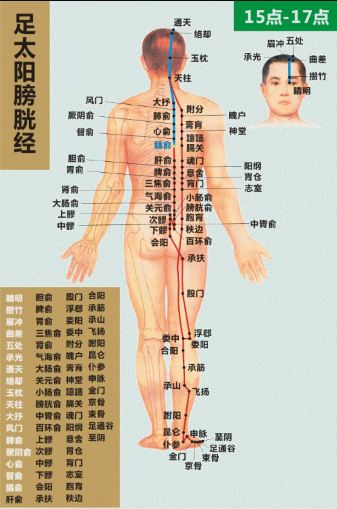

精明：眼睛内角肉球旁边，靠近鼻梁，中间位置。只针不灸。

​			治疗眼睛看不清，眼疾。

攒竹：眉头，下针方向朝眉心，斜下针，沿皮刺，只针不灸。

​			此处下针放血，治疗眼睛红肿。

眉冲：神庭与曲差中间，也在攒竹正上方。

曲差：督脉神庭穴 旁开1.5寸

五处：督脉上星穴 旁开1.5寸。

承光： 五处往后1.5寸。

通天：承光往后1.5寸

 

络却：通天后1.5寸

玉枕：络却后1.5寸

天柱：脖子后面的大筋跟头部交接的地方

​			经外奇穴 安眠穴： 天柱外开一寸。

**大抒**：陶道外开1.5寸，**骨会**，骨头有问题，按此穴会痛。

​			专治骨病（外伤骨头），会郗治疗法，会治骨，郗治消炎止痛

**风门**：第二椎下方，外开1.5寸

​			 治疗，后背脓疽（1.白头红块/灸，2.白色，没有头/灸或烧针，3.凹陷的/灸）

**肺俞**：第三椎下，外开1.5寸

​			俞墓治疗，慢性咳嗽，慢性支气管炎，内科病，肺的墓穴是中府下针到云门。

​			治疗忧郁想自杀，忧伤肺，在肺的俞穴和墓穴下针灸好了。

​			小儿龟背，就是肺里有很多痰，俞墓治疗，下针肺俞跟云门

厥阴俞（心包俞）：第四椎下，外开1.5寸

心俞：第五椎下，外开1.5寸				

​			心脏病的人，压第五椎会痛	

督俞：第六椎下，外开1.5寸，管督脉。

​			血癌在第六椎会有压痛点。西医说白血球太高，其实是因为督脉得不到正常的营养。

膈俞：第七椎下，外开1.5寸，**血会**。活血化淤的穴道。

​			治疗 贫血、淤血、出血，内伤打击导致的内脏出血，大便血，小便血。

​			消渴穴：第八椎下，外开1.5寸，经外奇穴。饮白杯不能解渴。

肝俞：第九椎下，外开1.5寸，肝病治此。

​			只有肝经会经过女人，男人的阴部，所以睾丸疝气，在此下穴针

胆俞：第十椎下，外开1.5寸

​			治疗胆结石。

脾俞：第11椎下，外开1.5寸，脾病治此

​			脾主四肢，不管是肌肉、关节痛、风湿痛、都可以在此穴下针。

​			脾主少腹，就是肚脐以下，腹部这变水肿，在此下针。强土可以治水。

​			小孩子不吃东西，可以灸脾俞，再灸身柱，小孩会长得又高又大。

胃俞：第12椎下，外开1.5寸，胃病治此，胃墓穴-中脘

​			

三焦俞：第13椎下，外开1.5寸，水病治此，三焦墓穴-石门

​				治疗 下利、大便带水、排水、水肿，吃东西不消化，治肚子胀满。

肾俞：第14椎下 命门（肚脐正后方），外开1.5寸，第14椎一下都可以直针下。

​			肾主骨，藏志，其华在发，开窍于耳，也管记忆力，管大小便。

气海俞：第15椎下，外开1.5寸。

​			治疗腰痛、靠近肛门这波，治疗痔疮。

大肠俞：第16椎下，外开1.5寸。

​				治疗腰痛、大肠的问题、便秘、下利。

关元俞：第17椎下，外开1.5寸。

​				治疗妇科、腰痛、子宫肌瘤。近取穴。

小肠俞：第18椎下，外开1.5寸。

​				治疗腰痛、小便失禁、妇科病。

膀胱俞：第19椎下，外开1.5寸。

中膂(ju)俞：第20椎下，外开1.5寸。

​				治疗肾虚、消渴病，大小便、腰痛，女人的赤带、白带。

百环俞：第21椎下，接近尾椎骨

​				因为接近阴部的地方，治疗疝气、大小便失禁、腰酸背痛，女人的白带。

上髎：第18椎下，外开7-8分，也就是督脉跟小肠俞中间。

​			像阴茎痛、睾丸痛、女人白带多

​			统治所有的腰痛，不管哪个位置的腰痛，都可以治

​			无法怀孕，也可以灸灸上髎

次髎：第19椎下，外开7-8分，也就是督脉跟膀胱俞中间

​			雷同上髎。近取穴

中髎：第20椎下，外开7-8分。也就是督脉跟中膂(ju)俞中间

​			雷同，近取穴

下髎：第21椎下，外开7-8分，也就是督脉跟白环俞中间

​			雷同上髎，治疗大便下血。

会阳：尾椎骨，外开1寸，很少用诊断用。

​			治症跟上面差不多，但是如果尾椎骨痛，说明是在膀胱经这里的问题。

承扶：臀部下面股沟，正好在大腿正中间横纹的这个地方

​			近取穴，对坐骨神经痛治疗效果很好。下针用三寸针。

殷门：承扶跟委中 中间，很少下针

浮郄：委阳上一寸

​			治疗麻痹不仁

委阳（络穴）：跟委中平行，外侧约1寸，筋的中间

​						 原络治疗法，原穴是取病经的，只有阳经有原穴，络取表里经的络穴。

#### 天柱穴下外分叉经络，合并于委中穴

附分：第2椎下，外开3寸。

​			手足太阳之会，跟肩中俞、肩外俞、大抒一样可以治疗 颈项肩背。

魄户：第3椎下，外开3寸。

​			治疗加强肺俞穴的治疗效果。

**膏肓俞**：第4椎下，外开3寸，同时坐在椅子上，抱枕头，肩胛骨打开，此穴才会出来，此穴无所不疗。

​				4椎下 至5椎分成3分，第一份下，外开3寸。

​			干活很卖力，会伤到这个穴道，很痛痛起来像螺丝刀在转，如果针不管用，就需要放血，

​			平常此穴是无所不治的，灸膏肓，可以灸100-500壮，灸完后，胸腔气很旺，

​			接着灸关元，气海，中级，石门，阴交都可以，灸的时候，气会往下走，或再去就足三里，这样就会把气往下导

​			主要是把热气导到脚里面去，脚热的人就没有癌症，心脏病，也不会中风。

神堂：第5椎下，外开3寸。也是心俞外开1.5寸

譩譆：第6椎下，外开3寸，也是督俞外开1.5寸

​			治疗血癌的时候，可以用针或者灸，帮助督俞。

膈关：第7椎下，外开3寸，也是膈俞外开1.5寸

​			治症跟膈俞差不多，像小便黄、大便不好，都可以用。

魂门：第9椎下，外开3寸，也是肝俞外开1.5寸

​			因为在肝脏旁边，也是辅助肝脏的，可增加肝俞的治疗效果。

阳纲：第10椎下，外开3寸，也是胆俞外开1.5寸

​			辅助脾

意舍：第11椎下，外开3寸，也是脾俞外开1.5寸

​			脾藏意，人体的意志，意念是脾脏在管

胃仓：第12椎下，外开3寸，也是胃俞外开1.5寸

​				辅助胃的穴道

肓门：第13椎下，外开3寸，也是三焦俞外开1.5寸

​				此处有压痛，治疗乳癌，辅助三焦，乳房也是三焦在管。

​			经外奇穴：痞根穴（意思是肿瘤的根），第13椎外开3.5寸，上下0.5寸附近。诊断是否有肿瘤，

​								也可以扎针治疗。

胞肓：第19椎下，外开3寸

​			近取穴 治疗 大小便的病。

秩便：第20椎下，外开3寸

​			很有名治疗痔疮的近取穴。

**委中**（合穴）：大腿膝盖后面 两个筋的正中间的穴道，这是第一大**解毒大穴**,也叫血郄穴

​			委中外侧是阳经，委中内侧是阴经，此穴汗比较多，不要灸

​			血里有毒，去血放毒、麻风病、背痛、皮肤癣、卡波西肉瘤。

​			放血步骤：人胸口靠墙，踮起脚尖，委中青筋鼓起，此时刺委中放血。

​			补井当补合。膀胱经补的话，用委中。背痛在膀胱经，补此穴。

合阳：委中直下三寸

​			辅助委中穴。

承筋：在委中和承山的中间

​			治疗脚抽筋，脚痉挛。

**承山**：脚踮起来，腿肚子会有人子纹，人子纹 顶部就是承山

​			治疗痔疮或者痔疮出血的大穴。灸或者针

​			游泳是脚抽筋，可以重压承山，就解掉了。

​			委中和承山常常并用，用在中风上面。腰背委中求，脚无力下承山

飞扬：（络穴）承山穴往下一寸，再外开一寸，刚好在人字横纹肌这边，下针一定在两个肌肉中间。

​				飞扬针下去，脚就像飞毛腿一样，当脚不能跑步，下针足三里、承山、飞杨，都是杨脚有力。

附阳：（阳跷脉郗穴）昆仑往上三寸

昆仑：（经穴，火）脚后跟的大筋跟外踝骨上沿中间

​			脖子后项背痛，孕妇不能下针，下针会落胎，小孩子会掉。所以此穴常用在，生完孩子，胎盘没掉下来，可以用昆仑，把胎盘掉出			来，这是用在生完小孩以后得。

​			奇穴：脚后跟上三寸，就在这两个大筋上面，就是消积穴。

​						找穴姿势，人爬着躺平，脚垂在床沿边上，这个穴位就不会动，用圆珠笔筒压，用压痛感，就代表身上有积，一样可以在这						里下针，治疗完以后，这里没有压痛，就治好了。

​						下针：这个穴道刚好在两个大筋中间，下针时，手要把大筋捉住，针直接从这个筋正中间下去，扎到骨头上。

仆参：昆仑下来再到踝骨头旁边

​			治疗后跟痛，脚后跟无法踩到地面，脚后跟跟肾有关。

**申脉**：外踝骨裸下五分有个骨缝的地方，申脉穴主管阳跷脉。

​			下针斜向下45度，不要垂直下针。

​			脚可以向右转，这是阳跷脉在管，向左是阴跷脉在管。

​			有的人不能转弯，有的人停不下来，要往前冲，还有的人更可怜，走两步腿三步，这都是阴阳不平衡。

​			第二个是癫痫，发病的时候，我们灸阳跷，就是灸申脉穴，隔姜灸。癫痫白天发作灸阳跷，晚上发作灸阴跷，照海。

​			灸到眼珠上的鸡爪慢慢退下去，没有碰到黑眼珠，就不会发作了。

金门：（郄穴）脚旁边有个凸骨，凸骨后面就是金门，骨头和肌肉中间

​				主治症状：身站，不能久立等。

**京骨**：（原穴）脚旁边有个凸骨，凸骨前面就是京骨，骨头和肌肉中间

​				膀胱经上的头痛，下京骨穴

**束骨**：（俞穴，木，子）脚小拇指根部后面横纹后面 骨头下面

​				治疗膀胱经上的脓疮，红肿。

​				治疗膀胱经的实证，实则泻其子，都是治疗经络上的痛

**通谷**：（荣穴，水，本穴）脚小拇指根部后面横纹前面  脚指骨头下面

​				可泻 金经（肺经，大肠经）的实症（痛3-4天）。

**至阴**：（井穴，金，母）右脚小拇指右下角旁

​				 虚则补其母，补井当补合，所以膀胱经的补的手法，可用委中穴替代。

​				特殊的治症：治疗孕妇胎位不正。

## 足少阴肾经

肾经属水，主骨，其华在发，开窍在耳，主记忆，欲望，思考，创新，也就主志，欲望太大伤肾。

声音在羽：吹的声

气喘：吸气困难->肾， 呼气困难->肺。

脚后跟痛的问题 是肾的问题。

治疗一切喉咙问题： 列缺+照海。阴跷脉跟肾经上来的时候是重叠在一起的直到喉咙这边。

​									扁桃体发炎肿大，先有三寸针两边刺破，然后下针列缺，再下针照海，马上就不痛治好了；如果想以后再不复发

​									用五钱夏枯草，加个生鸡蛋带壳的，两碗水煮成一碗水，鸡蛋吃掉，水也喝掉，终生不复发。

眼诊法：通过眼睛颜色判断五脏哪里有问题。

​				肾：眼袋，黑黑的肾脏已经受伤；凸起来像卧蚕，水肿；没有凸起，暗红色，水克火，，肾脏病

消炎、解毒、镇痛、痒：治疗肚脐以下用筑宾。肚脐以上用曲池。

管**气的纪律**、周边的循环：肚脐以上是 巨阙，肚脐以下是关元，

治疗全身皮肤病 十针：曲池、合谷、筑宾、血海、三阴交。五个穴道工十针，针下去痒就去掉了。

对称治疗： 委中 外侧痛就下 曲池， 内侧痛扎 少海；手踝关键痛 太渊痛，下太溪。

乳房硬块初期：中医治疗处理得当，不会得乳癌。

​				

​		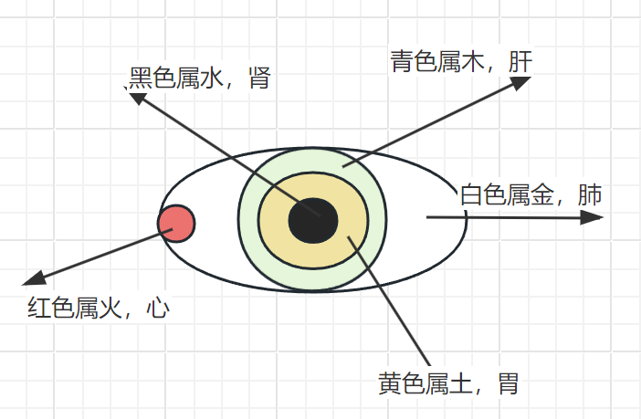

### 穴道

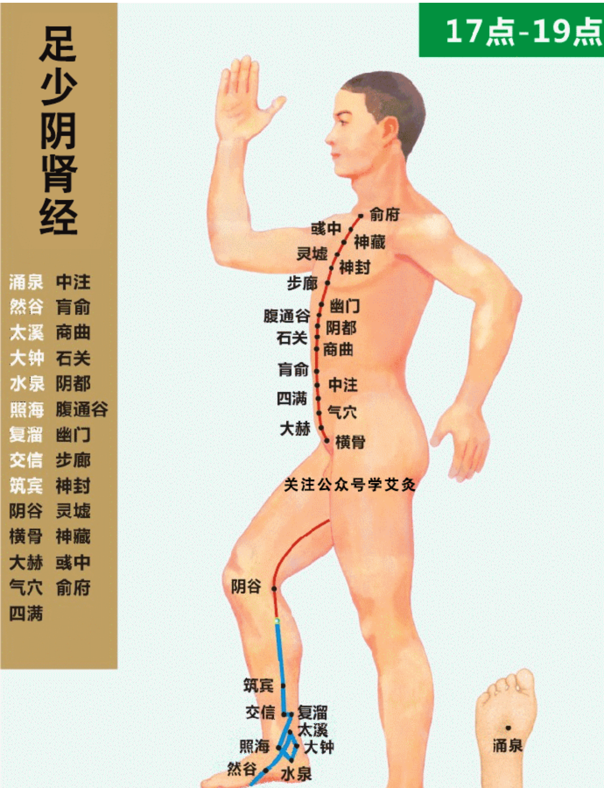

**涌泉**：（井穴，木，子穴）脚底人字纹  交叉点下。此穴毕竟痛，泻井当泻荣。

​			  治疗顽固头痛，妇人无子、水肿。

**然谷**：（荣穴，火）脚这波有个高骨，高骨下面是公孙穴，公孙往后一寸就是然谷。

​			 病人头部受到撞击，脑震荡以后，然谷穴会崩起一块青筋，然谷放血，治疗脑震荡。

​			 治疗肾经实证，泻井当泻荣。

**太溪**：（俞穴，土）脚内踝高骨与脚后大筋中间，有个太溪脉，太溪脉在肾气还在。

​				肾结石诊治：太溪穴上1-2寸左右有压痛感。太溪脉上画个小肾模型。治疗在具体压痛点上下针。

**大钟**：（络穴）脚后跟骨头跟大筋交接的地方

​				虚实都可以治疗。肾经的实证，小便排不出来；虚症如腰酸痛。

水泉：太溪穴 垂直下来到后脚跟骨边的地方

​			治疗脚后跟痛，左脚痛扎右脚水泉。

照海：内踝裸下 5分的地方。泻向下45度，沿着内踝骨向下。管阴跷脉

​			癫痫的病，夜晚发病就灸照海，灸阴跷脉的照海穴。白天晚上都发病，就申脉、照海一起灸。

​			治疗女性逆经，阴跷脉有问题把月经推回来，没有排出来，上推到嘴巴、鼻子里跑出来血，变成每月固定流鼻血，就用照海穴。

复溜：（经穴，金，母穴）太溪穴正直上2寸的距离就是 复溜，下针时病人有麻电的感觉。

​				治疗肾经上的虚症。补的手法是 顺着经脉的流向斜一点下针，再顺着经脉流向转针，再拔出来一点点，就是大补。

​				临床症状：遇到水肿，小便不出，肚子肿胀腹鼓。可用此穴。

​				灸灸关元、复溜是非常好的，促进肾经气血，脚变热，水气化，排出体内多余的有害的阴水，不容易得癌症。

交信：复溜往水平中间一寸，到骨头旁边。阴跷脉的郗穴

​			治疗女子月事不止或滴漏不止，还有阴挺，就是子宫下垂到外面来。

筑宾：太溪穴直上5寸，再后开一寸。阴维脉的郄穴

​			治疗肚脐以下的镇痛、解毒、消炎、痒的症状

阴谷：（合穴，水，本穴）脚膝盖垂直90度，手指塞进夹角内侧摸到2个筋，筋内侧靠近骨头的地方

​				治疗 肝胆(木)的虚症-下补针， 泻 肺与大肠(金)的实证- 下泻针。

​				也是治疗妇科的大穴，像治疗白带这些都可以用。

横骨：曲骨穴外开一寸的距离就是 横骨，冲脉跟肾经回合处，一起往上走，肾经这段跟冲脉交接在一起。

​			治疗男人失精，梦遗。

大赫：中极外开一寸

​			治疗阴缩，睾丸缩到腹部里面去，妇人的赤带、白带。

气穴：关元外开一寸

​			治症跟 大赫差不多。

四满：石门外开一寸

​			治疗肠鸣，腹泻。

中注：阴交外开一寸

​			越靠近肚脐的地方，就是治疗大肠的问题。

盲俞：神阙外开一寸

​			治疗大肠的问题

商曲：下腕外开一寸

​			有个病人肾脏病，水肿，整个下半身都是肿的，小便滴滴答答的，

​			用任脉的 水分穴，足阳明胃经的水道，脚的三皇穴。针下去水就开始消，针完第二天就好了一大半。

石关：建里外开一寸

​			治疗胃涨，没有胃口。

阴都：中脘外开一寸

腹通谷：上腕外开一寸

​				治疗胃的停饮，胃不消化及一般的胃病

幽门：巨阙外开一寸

​			在主力穴外开的穴道都可以辅助主力穴，巨阙治疗 心脏问题，若下了巨阙，心脏还有闷痛，就下幽门，来加强力量。

步廊：中庭外开2寸

神封：步廊往上 隔一个肋骨，很接近膻中穴

​			治疗咳逆、乳房硬块。

灵墟：神封往上 隔一个肋骨，玉堂外开2寸

神藏：灵墟往上 隔一个肋骨，紫宫外开2寸

彧(yu)中：神藏往上 隔一个肋骨，华盖外开2寸

俞府：彧中往上 隔一个肋骨，璇玑外开2寸

## 手厥阴心包经

心包的墓穴：膻中

心脏病的问题，注意病人的发汗，流汗。

心脏的问题，一般都是心包的问题，心脏本身不受病。

时间夏至-冬至 心包经 五行属火；

时间冬至-夏至 心包经 五行属水；

### 穴道

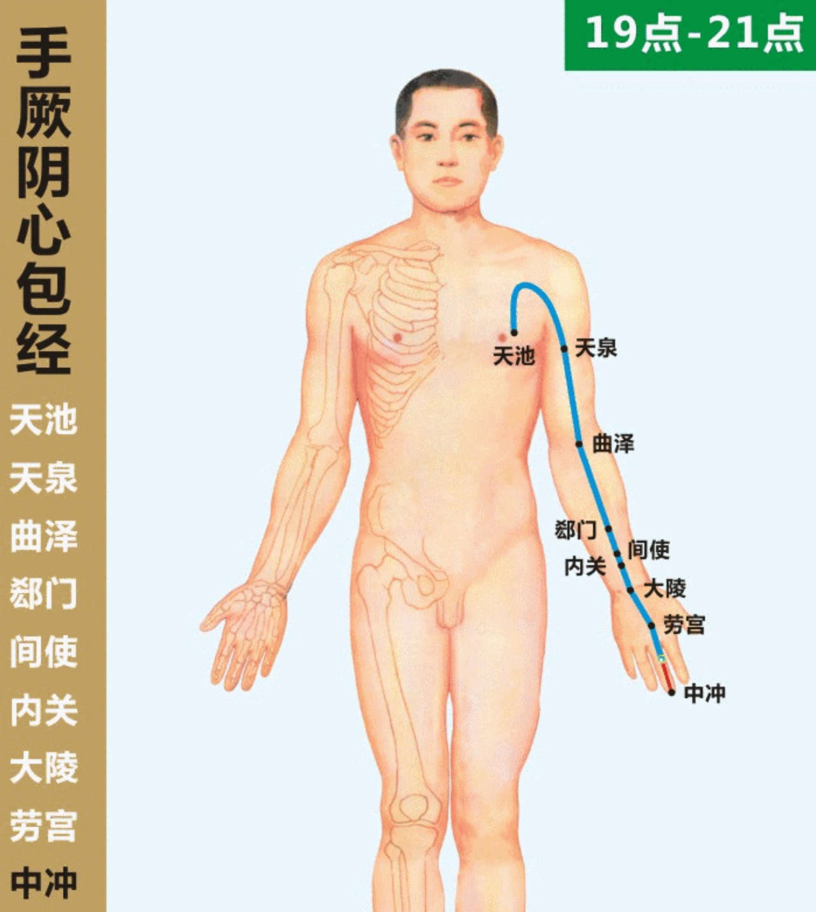

天池：乳中穴旁开一寸

​			治疗乳房硬块，下针还是在心包经，灸还是在天应（啊是穴），取穴还是心包经。

​			只有哺乳期期时治疗乳房硬块是在阳明经上治，确保奶水往下走，不会有多余的奶水累积在乳房。

​			临床上治疗包括四肢不举、腋下肿。这是近取穴。

天泉：腋下横纹头（顶点） 下2寸

​			

曲泽：（合穴，水）手弯起来，中间有摸到一条大筋。大筋的上面外侧是肺经尺泽，内侧是心包经曲泽。

​				对称治疗：腿上的委中，委阳痛，下针曲泽。

郗门：（郗穴）手肘内侧，手腕横纹头上2个大筋中间往上5寸

​				止痛的效果非常好。

间使：（经穴，金）手腕横纹头上2个大筋中间往上3寸

内关：（络穴）手腕横纹头上2个大筋中间往上2寸，管阴维脉（肋骨里面的经脉）

​				（止吐或催吐）呕吐呕不出来，按住内关，心理默念（想吐或者不想吐）

​				治疗 胃病、心脏病、胸口 气喘咳嗽痛，内关+公孙下去 喘就去了大半，胃痛也去了大半。

大陵：（俞穴，土）手腕横纹头上，下针时斜着对手掌

劳宫：（荣穴，火）手握拳，中指和无名指交接点。此穴不会在这里灸，下针为主

​			  治疗小孩子退烧，

中冲：（井穴，木）从劳宫直达中指的头部位置

​			   补井当补合。

## 手少阳三焦经

三焦经是 行阳气的，遍布五脏六腑。三焦可以治万病。

三焦经：决渎之官，水道出焉。

三焦经墓穴：石门

上焦：胸蔽骨以上；雾

中焦：肚脐至胸蔽骨；沤

下焦：肚脐以下；渎

身体忽冷忽热，阴阳相抗争的时候，病想进入内脏的时候，从三焦经上入手，会很好。

五行属火

夏至-冬至：阳经（金水木火土）

冬至-夏至：阴经 （木火土金水）

胸胁背痛诊断： 背后横的肋骨痛，就是在阳维脉，下外关

三焦经引起的手臂痛：一般来说不能梳头，病人用筷子夹菜，夹到嘴边，筷子一闪，食物掉了，筷子碰不到嘴巴。

手肘不能往后，往后搬不上去，不能抓后背的痒，这是小肠经。

开天河水：幼儿发高烧，用指针法，

​				  男孩：将手指头按到外关穴，揉一揉，揉个二、三下，然后往下推到手指末梢，从阳经这样推下来，天河水就会从这边出来，								然后进入手掌内部。

散天河水：用心包经的间使穴，按到它，一揉，天河水就散掉了，手法是让小孩子手握拳，中指头往前推，

​					让他中指会弓起来，然后慢慢揉压中指几下，烧就退了，这里刚好是劳宫穴，心主五液，流汗出来烧就开始退。

幼儿去寒：就从三关（食指、中指、无名指），往内关推，这是去寒；男左女右，男女推的手法相反。

​	

幼儿惊吓：眉宇之间会有一条青筋，双手一起揉小孩子的耳轮，揉到小孩安静、开心、睡着、

​					如果小孩眼珠子往上掉，揉耳朵时把耳朵往下拉一点。如果眼珠子往左侧偏，就右侧耳朵揉用力拉一点，左侧耳朵放松揉。

幼儿病情诊断：三关（手指三节，从食指指尖依次-命关、气关、风关），青筋在风关，病在表；青筋在气关，病在里；

​						    青筋在命关，病重

**指针术**： 主要幼儿适用，首先判断手腕处 6条筋的位置。然后那个脏腑的问题，推哪个筋。

​				 由身体往四肢末梢推，去热；由四肢末梢往身体方向推去寒。

​				 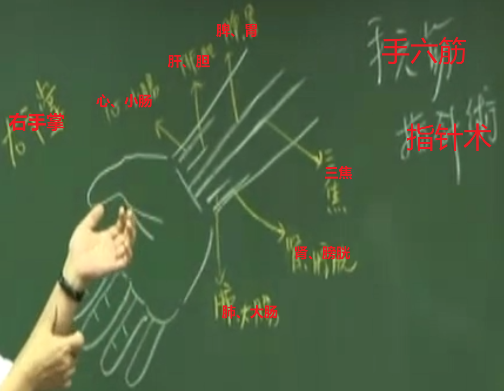

### 穴道

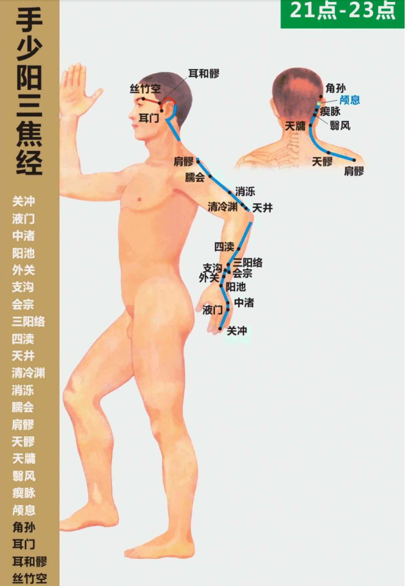

关冲：（井穴，金）左手无名指指甲左下角。

​				井穴可以急救昏迷。

液门：（荣穴，水）从井穴到我们这凸起来的两个骨头后方，无名指指掌跟小拇指指掌缝隙处。

中渚：（俞，木）液门往后一寸

​				

**阳池**：(原穴)手的背面，手腕关节正中间有个凹洞。

​			治疗糖尿病消渴很有名的穴道。下针阳池透到大陵

​			对称治疗：解溪穴。

**外关**：阳池往上2寸，管阳维脉， 此穴通生死桥（外关透到内关）

​			治疗小孩子发高烧，外关透到内关，很快就退烧。下针时，手指不要乱动。

**支沟**：（经穴，火）外关往上一寸。

​			治疗便秘效果很好，支沟+照海一起，24小时之内就会排便。

​			妇人难产、胎衣不出、或者滴漏不止、任脉不通。都可以在支沟上下针。

会宗：支沟平行移到下面骨头旁边

**三阳络**：支沟上一寸，此穴气脉很强，下针下的好，会出现点头针

​				治疗经筋的病，声音哑掉，耳聋。

四渎：在手肘骨尖，往下5寸

**天井**：(合穴，土) 手肘弯曲，四渎往上摸到翻过肘骨尖，两个筋的中间有个凹缝，一般病人采取卧姿，手肘弯曲下针。

​			右膝盖头痛就扎左边天井穴，也可以下右边天井穴。

清冷渊：天井上一寸

​				发烧可以在清冷渊下针。

消泺：清冷渊上3寸

​			

腧会：清冷渊上5寸

​			治疗甲状腺功能亢进，脖子肿，脖子强硬，淋巴有肿瘤。

​			一般来说有非常多的穴道治疗淋巴结、甲状腺肿，一般来说找天应（三焦经上摸到痛点处下针）。

肩髎：手臂上方，手背弯起来有一个凹洞，这个是肩俞穴。从肩俞穴跨一个大筋道后面的凹洞，就是肩髎

​			治疗手臂痛，肩膀不能抬举。

天髎：

天牖：颈后中间有两个大筋，旁边还有一条大筋，大筋和头骨交接处。

​			很少下针，也不能灸。

翳风：天牖穴到耳朵后方，由侧面看，在耳朵下方，这个下颚骨头后面差不多一寸的地方。

​			治疗耳鸣耳聋，下巴脱臼，牙关很痛。

​			压痛下针：先下对侧的合谷，再下针下关、颊车、翳风，下完针起来就好。

瘈脉：耳朵翻起来，这后面有个骨头叫智慧骨，骨头下方 旁边就是瘈脉穴，也就是翳风上来一寸半

​			此穴不灸，主要是针灸，放血

​			耳朵后面有一条经经过就是三焦经。沿着耳朵一圈痛，痛几天三焦经泻子穴，痛1个月三焦经补母穴

​			中风急救时，如果耳朵翻开来看，有很多青鸡爪血脉，拿三棱针，在血脉头放血，血放出来，人就会醒来。

​			癫痫也在这里放血，小孩子脑膜炎、角弓反张、高烧不退都可以在这放血。

颅息：智慧骨上方凹洞的地方，瘈脉跟颅息刚好隔一个智慧骨

角孙：耳朵拉下来，耳朵最上方到发际这边，中间这个地方。

​			在越靠近眼睛的穴道，都是用在眼科的治证，比如白内障、青内障

耳门：嘴巴张开，耳朵这边会张开一条 竖直的骨缝，骨缝上边就是耳门，骨缝中间是听宫（小肠），骨缝下边听会（胆）

​			

耳和髎：丝竹空到耳门之间，三焦经经过的地方，耳门前斜的半寸到1寸的中间，你摸有个动脉在跳，这就是和髎穴。

​				下针时，先把脉用手指把动脉推开，然后下针。

丝竹空：在眉毛的后方。眉毛尾端就是丝竹空

​			    在眼科：睫毛倒长，角膜炎，眼红肿。在攒竹、丝竹空、瞳子髎（太阳），还有耳尖放血，刺破，挤几滴血出来，就好了。

​			    常常放血，对视力非常好。因为这里有血堵着，有很多湿热，湿热多的时候就是有很多病毒，放血后，新的血液过来，带着白血			    球，抗体，病就去掉了。

​			    脸上的穴道一般不灸，就是下针、放血。

​				奇穴：眉棱点，阴陵泉下一寸； 我们有一种痛叫眉棱骨痛，左边眉棱骨痛，找到右脚眉棱点穴，按压有痛感，扎此穴。

​							头痛在两眉中间，是胃，下中脘；头痛在眉棱骨上，在眉毛的下方的骨头上，就扎阴陵泉下一寸。

## 足少阳胆经

五行属木：肝木（阴） 生 阴火（心脏-火）

​					胆木（阳） 生 阳火 （小肠-火）

胆结石： 强心脏、补肝脏加强肝脏代谢。

有个小孩看东西，左右颠倒吧b看成d；肯定是小时候呕吐太严重，把胆囊吐翻转过来了。

### 穴道

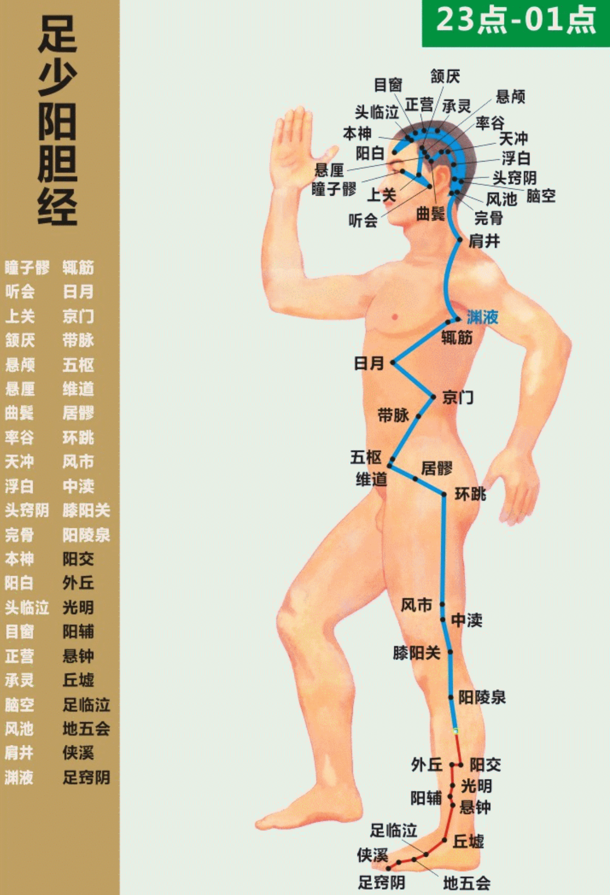

**瞳子髎**：简称太阳穴，下针 一寸针入半寸即可，不要扎很深。

​				治疗眼睛发炎、红肿、角膜炎。临床上我们最多的就是在太阳穴放血。

**听会**：张口，耳朵旁骨缝 下边缘。下针手法不捻针，而是上下插几下。

​			治疗耳鸣：物理造成的，潜水造成的，就是再从原来的地方潜水，上浮的时候要慢慢的。

​								音响造成的，就再回到原来音响的地方，开最大声，然后慢慢的开小声。

​								肾脏问题造成的，就治疗肾上入手。

上关：听会到太阳穴中间有高骨，高骨上面凹洞就是 上关， 高骨下面凹洞就是下关。

颌厌：头维穴（足阳明胃经第一个穴道） 往下一寸，在发际这边也有个动脉，用指甲把血管推开，下针

悬颅：颌厌往下1/3；颌厌与曲鬓中间分成3段

悬里：曲鬓往上1/3；颌厌与曲鬓中间分成3段

曲鬓：跟耳朵很接近，这上面也有个动脉，用指甲把血管推开，下针

**率谷**：耳尖往上1.5寸。

​			治疗偏头痛：瞳子髎透率谷，先下针瞳子髎，然后把针起来到皮层，斜着刺到率谷，过程中把皮抓起来，沿着皮刺

​									也可以提前下止痛穴，下对侧合谷。发病痛的时候才下针，效果最好。

​			

天冲：

浮白：

头窍阴：

完骨：

本神：头临泣再跨过来1寸。

**阳白**：眉毛和发际中间，眼睛正上方。

​			把皮拉起来，从上往下针到皮里，阳白透鱼腰（因为眉毛像鱼一样），治疗眼睛近视、视物不明、眼睛

**头临泣**：曲差旁开5分，病人躺着，眼睛正上方到发际这边，发际往后1.5寸，一摸有个骨缝，这就是头临泣

​				尤其是治疗风泪，眼睛风一吹就流泪。

目窗：头临泣直直往后一寸半就是目窗

正营：目窗再往后1寸半就是正营

承灵：

脑空：

**风池**：脖子后面两条大筋中间就是风府穴，风府穴下面一点，在两条筋的旁边凹陷的地方就是风池

​			治疗鼻窦炎、鼻子不通时效果很好，一针下去鼻子就通了。左边鼻子堵了，下右边风池穴。

​			此穴治疗脖子风寒、脖子僵硬，灸、拔火罐、刮痧都可以。

**肩井**：就在肩膀上方，正好在肌肉最高的地方，按下去，在两片肌肉的中间。

​			不能下深针，5分-1寸就够了，下针超过1.5寸-2寸，人会昏倒。孕妇不能下肩井，往下的气很强，会堕胎。

​			肩井穴要和足三里配合使用，不然只扎肩井穴，气会闷在胸口。左肩井穴配合右腿足三里。

​			治疗胸腔受到重击，跌打损伤，里面有淤血；例如骑马摔下来，被马踢到，胸腔有淤血；针下去以后，病人大便是黑便。

​			当病人肩项强硬、脖子酸，后脑、后项这边酸，最常用的穴道是 后溪（主督脉）跟申脉（主阳跷脉），

​			 这两个穴道治疗所有的肩项的病。针了 后溪申脉后，痛就去了大半，若还有一点，可以下肩井。

渊液：极泉正下方三寸

辄筋：渊液往胸前一寸

**日月**：（胆墓穴）从巨阙旁开四寸，到两个肋骨中间，这是期门穴（肝墓穴），期门往下一寸，隔一个肋骨，这个肋间就是日月穴

​			  治疗胆结石，用俞墓治疗法，俞墓就是运输的意思，下胆俞（背后膀胱经） 跟胆墓（日月穴）

**京门**：（肾墓穴）手肘靠着肋骨，手肘尖就正好是胸肋骨最下面的那个点，这个是肝经的章门穴，再往后摸，刚好有个肋骨从后面凸出。

​				这个肋骨头上面就是京门穴，就是最后一根肋骨顶点。

​				治疗肾脏实证或虚症的时候，用俞墓治疗法，无所谓虚实。肾结石、肾脏癌、肾阳虚、阴虚，耳鸣，腰酸，水肿，都可以

​				我们扎完 肾俞穴(膀胱经)以后，再扎京门穴。这两个穴道常常是一起使用。

​				

带脉：章门穴往下走1寸八分。两个肌肉中间，肌肉缝。

​			带脉环腰，只有三个穴道（带脉、五枢、维道）

五枢：水道 外开5.5寸

维道：中极 外开8寸 

​			华佗夹脊：督脉旁开5分，督脉跟膀胱经中间，沿着督脉上下。治疗这条经脉上的背痛，用足三里 + 临泣穴两个穴道。

居髎：从章门穴直下8.3寸， 这附近摸，在肌肉跟骨头中间

**环跳**：(骨之始)人坐下，腿姿势像蹲马步一样的，摸整个大腿骨，摸到骨头的末端

​			手碰到这个骨头末端，握拳对着这里，大拇指指尖到处就是环跳穴，用三寸针下针，扎到骨头旁边到关节处，感觉针碰到关节

​			下去以后不留针（三呼三吸），扎到以后，一般都手法是左右一捻，引到气，病人很酸，加他吸气，吸的时候拔出来，拔到皮肤表			面；然后叫他吐气，吐气的时候针不要动，等他吐完气，然后再慢慢推到穴道的地方。让再吸，一边吸一边拔，连续做三下。

​			骨病之初：环跳一定会痛(骨癌、或者骨头有损伤)，一个人每2年换一套全新的骨头，初始是从环跳开始换，终点是手指头边										跟脚指头边。

​										肩髃和环跳 可以配合使用，对称取穴，环跳痛下针肩髃。

​			治疗 骨病之初、中风、半身不遂。

**风市**：腿外侧，膝盖交接的缝处直上7寸，三寸深针，下针要碰到骨头

​			治疗中风、瘫痪、脚、膝盖麻木不仁的大穴。

中渎：风市下2寸

​			加强风市的穴道。

膝阳关：腿外侧，膝盖交接的缝处，次穴道很浅，一寸针扎下去就酸了。

​				近取穴，治疗风湿性关节炎、痛风、红肿都可以治疗。

**阳陵泉**：()筋会阳陵泉，取穴的时候身体自然坐直，此时大腿和小腿会形成直角，在腿弯处小腿外侧上方肉眼可观察到或者是用手触摸到					有一突出的骨尖，这就是腓骨，阳陵泉穴就在骨尖的前下方约三横指的凹陷处，针下去一定在两个肌肉中间。

​				  一般治疗膝盖痛，阳陵泉透阴陵泉效果非常好。阳关+阴陵泉+阳陵泉  一共4针。

​				 治疗膝盖不得屈伸、脚抽筋

​				奇穴：胆石点，阳陵泉正下方1寸，胆结石的人这个穴道有压痛点，这个穴道治疗胆结石的痛，不痛的话，胆结石就治疗好了。

阳交：(阳维脉的郗穴) 外丘水平往后一寸

​			治疗发狂奔走、抽筋、脚痛。

​	

外丘：（络穴，此穴络到肝经上）外踝裸直上7寸，解毒的穴，加强人体解毒能力，肝胆本身就是解毒的器官。

​				治疗疯狗要到腿了，用隔姜灸，先把生姜打洞放到咬伤处，然后就在齿痕处方艾绒，用隔姜灸，同时要灸外丘，灸三壮。

​				艾绒本身是纯阳的，是解毒的，黑蜘蛛咬伤也是一样的处理，不管什么毒，它就能分解它的毒。

光明：（络穴，络厥阴）外踝裸上5寸，顾名思义，眼睛放大光明的意思。

​				治疗眼科的治症，类似治疗眼科的穴道有（瞳子髎、丝竹空、攒竹、睛明穴、承泣、四白、养老）

​				

**阳辅**：（经穴，火，子穴）外踝裸上4寸

​			治疗胆经的实证，通通在这里治疗。

悬钟： 外踝裸上3寸，也叫绝骨穴，髓会绝骨，从外踝裸用指头摸上去，刚好凹下去地方就是绝骨穴

​			绝骨穴越高，越聪明，脑容量越大，因为髓会绝骨，脑为髓之海

​			治疗骨髓的问题，骨髓生病绝骨会找到压痛点。

丘墟：(原穴) 外踝裸下方，脚胫骨跟脚掌骨头交接缝隙，原穴就是三焦经跟六条阳经交会处

​			专门治疗脚扭伤，一寸半针 商丘穴 透到 丘墟穴

足临泣：（俞穴，木，本穴）脚小趾头拉一拉，会发现有个筋动，从丘墟穴往下走到 这个筋后面就是

​				治疗 带脉的病(腰痛是横着一圈痛，像皮带)，胆经经过的地方的病

地五会：足临泣  往下翻过这条筋就是，这里有个动脉，注意拨开动脉下针

​				治疗乳房硬块的大穴，特殊的治症就是脚皮特别干的人

侠溪：（荣穴，水，母穴）脚五趾跟四趾 高骨夹的中间位置。

​			 治疗胆经的虚症，斜着向下 偏移5分 顺着经络的方向下针

​			 治疗胆经上的偏头痛、耳鸣，对侧的侠溪下针

足跷阴：(井穴，金) 脚四趾 外侧指甲下脚旁5分

​				临床上，头昏眼花，昏迷，病人眼睛痛外侧眼。

## 足厥阴肝经

阴经、 肝五色  属青，五行属木，五味属酸，五声属  (嘘)

五脏排毒法： 手捂住肝脏的位置，吸气，然后发出嘘的声音呼气，气完了才刚开始，再用力气发出无声的嘘，3-5次就可以了。

人能眠是因为血能归肝， 心藏神(19-21)、肝藏魂(1-3)、肺藏魄(3-5)，神，魂，魄能守主其位，就能睡得好。

**四关**：太冲(主血)、合谷(主气)， 同时针太冲、合谷，叫开四关，气血均匀增强。

​			人体左侧主血，右侧主气。病人说我全身痛，具体说不出清楚，就开四关，气血增强后，痛的位置会转变，就知道病灶在哪了。

合谷是气脉、太冲是血脉；冲阳管胃气 、冲阳脉管血，管肝脏，有脉则生，无脉则死；太溪脉管肾脏

奇穴（治肝三穴）：专门治疗肝癌、肝硬化的大学；

​									位置在 膝盖头模到大腿内侧，这边取一条线。假想一条线，心里面想中间一点，往前一寸，往后一寸，中间点叫肝									1、第二个叫肝二，这个叫肝三。

​									病人有肝病了，全身黄疸，我要知道是肝炎，还是肝硬化肝癌，如果病人在这个三个穴道一压，很痛，那不是肝硬									化就是肝癌。如果病人同时右肋很痛，可以下肝关，肝经的郗穴来震痛

​									肚子有积水，下阴陵泉、地机、三阴交。肚子上也可以下 水分、水道。

肝病，肝癌，先强土，然后强水，让水生木。当我们强土强水的时候，病人会一直打嗝，这就是病人到我们手上已太慢了。

实际上不管初期、中期、末期，西医从来没有治好过肝病，一般腹水产生的时候，是50:50的概率，我有救回来的，也有救不回来的。

### 穴道

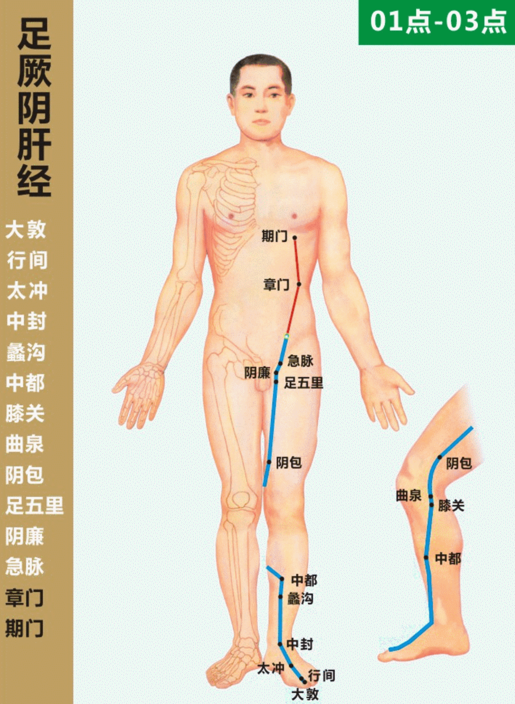

**大敦**：(井穴、木，本穴)脚大拇指外侧下角

​			本穴虚实都可以治，治疗疝气(睾丸掉下来,睾丸旋转)、子宫下垂、性病、阴部痛

**行间**：脚大拇指跟食指 末端  脚掌两个凸骨 中间 缝隙处。

​			治疗时症，病人1-3点不能睡。行间，太冲都可以。

**太冲**：(俞穴 ) 足背侧,第一、二跖骨结合部之前凹陷处

​			治疗 妇科女人漏下、滴漏不止、血崩、、月经不停; 睾丸痛、阴茎痛、小便带血

中封：(经穴) 内脚踝附近  商丘 解溪 中间的穴道

蠡沟：(络穴) 内脚踝 上5寸

​		   虚症实证都可以下针，如果有人吃了威而刚。结果阴茎软不下来，这是肝经的实证，可以用络穴，或者子穴，让它下来，或者放冰			水，否则不得了。

​			肝经的虚症出现的时候是皮肤痒。

​			现在又出来一个沟，如水沟、蠡沟，这个沟的所在经脉 就是有淤积、有积块，所有的沟都可以取。腹胀满少腹有积块，我们有沟			的、谷的，如阴谷。如这个蠡沟、水沟。谷如小肠经的本穴阳谷穴，都是沟、谷，通通可以取。

中都：蠡沟上2寸，内脚踝上7寸

​			治疗妇人产后恶露

膝关：膝盖横纹头，实际上是扎上5分的地方，不要扎到横纹头

​			治疗膝盖风湿性关节炎效果非常好

曲泉：大腿骨旁边有个大筋，大筋的内侧和骨头的中间

​			阴茎 挺不下， 阴部痒

阴包：曲泉 沿着大腿骨方向往上 三寸

​			治疗小便困难、女人月经不好，其原因可能是肾结石或者膀胱结石，或者小肠太寒了，或者尿道感染。

足五里：曲骨外开2寸(气冲)，再下来三寸，再旁5分

​				助孕

阴廉：足五里往上 1寸

​			助孕

急脉：

章门：侧面 最后一根肋骨尖 正下方;手肘弯曲靠近侧面，手肘尖的地方。

​			脏会章门，治疗五脏气乱，五脏有问题；心脏跳的很快，这也是奔豚的一种，像脾主胃口、呕吐等等。

​			斜刺针 从正面往后刺，不是左侧垂直往内脏刺。

期门：(肝墓) 胃经不容穴外开1寸半；第一个肋骨跟第二个肋骨中间是日月，再跳过一个肋骨就是期门

​			斜刺针 从正面往后刺，稍微往外侧刺。	肝不好可以多灸一灸这里。

​			治疗 胸胁苦满，胁下痛、肝脏痛。怒伤肝，多看一些赏心悦目的东西，或者悲的东西，像苦恋花那种，流泪对肝很好。

​			病人呕吐、吐酸都是肝脏的问题。热入血室，小柴胡汤比较慢，扎期门很快。

